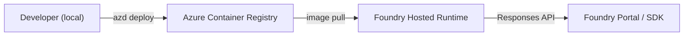

# 01 — Your First Hosted Agent

Deploy a containerized agent to the Foundry hosting platform using Microsoft Agent Framework (MAF). By the end of this lesson your agent will be running in the cloud and responding to prompts.

---

## What is a hosted agent?

A **hosted agent** is a containerized application that Foundry runs and manages for you. You write the agent logic in Python, package it in a Docker container, and deploy it with `azd`. Foundry provisions the infrastructure, handles scaling, injects credentials via managed identity, and exposes the agent through a standard **Responses API** endpoint.



Key characteristics:

| Feature | Detail |
|---------|--------|
| Runtime | Container on Foundry-managed infrastructure |
| Auth | Managed identity injected at deploy time |
| Protocol | Responses API v1.0 |
| Port | 8088 (fixed) |
| GPU | Not required for inference (model calls go to your deployment) |

!!! tip "Alternative scaffolding"
    You can also create the project structure interactively with `azd ai agent init`. In this workshop we use pre-built files so you can see every piece explicitly.

---

## Project structure

```
examples/01-first-hosted-agent/
├── main.py            ← agent logic
├── agent.yaml         ← hosting metadata
├── azure.yaml         ← azd project manifest
├── Dockerfile         ← container definition
└── requirements.txt   ← Python dependencies
```

---

## The code

[`examples/01-first-hosted-agent/main.py`](https://github.com/beyondelastic/foundry-advanced-workshop/blob/main/examples/01-first-hosted-agent/main.py)

```python
"""Lesson 01 — Your First Hosted Agent."""

import os

from azure.identity import DefaultAzureCredential
from dotenv import load_dotenv

from agent_framework import Agent
from agent_framework.foundry import FoundryChatClient
from agent_framework_foundry_hosting import ResponsesHostServer

load_dotenv()

credential = DefaultAzureCredential()

client = FoundryChatClient(
    project_endpoint=os.environ["AZURE_AI_PROJECT_ENDPOINT"],
    model=os.environ["AZURE_AI_MODEL_DEPLOYMENT_NAME"],
    credential=credential,
)

agent = Agent(
    client=client,
    instructions=(
        "You are a helpful healthcare assistant. "
        "You answer questions about general health, wellness, and medical terminology. "
        "Always remind the user that your answers are for informational purposes only "
        "and not a substitute for professional medical advice."
    ),
    default_options={"store": False},
)

server = ResponsesHostServer(agent)
server.run()
```

---

## Step-by-step walkthrough

### 1. Authenticate with `DefaultAzureCredential`

```python
from azure.identity import DefaultAzureCredential
credential = DefaultAzureCredential()
```

Locally this uses your `az login` session. When deployed, Foundry injects a **managed identity** automatically — no code change needed.

### 2. Create a `FoundryChatClient`

```python
client = FoundryChatClient(
    project_endpoint=os.environ["AZURE_AI_PROJECT_ENDPOINT"],
    model=os.environ["AZURE_AI_MODEL_DEPLOYMENT_NAME"],
    credential=credential,
)
```

The client connects your agent to a specific Foundry project and model deployment. The `project_endpoint` is the full URL from your Foundry project settings (format: `https://<account>.services.ai.azure.com/api/projects/<project>`).

### 3. Define the `Agent`

```python
agent = Agent(
    client=client,
    instructions="...",
    default_options={"store": False},
)
```

- `instructions` — the system prompt that shapes the agent's behaviour.
- `default_options={"store": False}` — disables server-side conversation storage. Useful during development.

### 4. Wrap in a `ResponsesHostServer`

```python
server = ResponsesHostServer(agent)
server.run()
```

`ResponsesHostServer` exposes the agent via the **Responses API** protocol on port 8088. This is the interface the Foundry runtime expects.

### 5. `agent.yaml` — hosting metadata

```yaml
kind: hosted
name: my-hosted-agent1
protocols:
  - protocol: responses
    version: 1.0.0
environment_variables:
  - name: AZURE_AI_MODEL_DEPLOYMENT_NAME
    value: ${AZURE_AI_MODEL_DEPLOYMENT_NAME}
  - name: AZURE_AI_PROJECT_ENDPOINT
    value: ${AZURE_AI_PROJECT_ENDPOINT}
```

- `kind: hosted` tells Foundry to manage this agent.
- `protocols` declares which API the agent speaks.
- `environment_variables` maps values from your Foundry project environment.

### 6. `Dockerfile`

```dockerfile
FROM python:3.12-slim
WORKDIR /app
COPY . user_agent/
WORKDIR /app/user_agent
RUN if [ -f requirements.txt ]; then pip install -r requirements.txt; fi
EXPOSE 8088
CMD ["python", "main.py"]
```

This is the standard Dockerfile pattern for hosted agents. Foundry expects port 8088.

---

## Try it

### Initialize the azd environment

This connects your local project to your Azure resources (subscription, project, ACR). You only need to do this once per machine.

!!! info "Prerequisites"
    This assumes you've already provisioned resources using `infra/main.bicep` as described in the [Prerequisites](00-prereqs.md). The Bicep template creates the Foundry account, project, model deployment, ACR, and role assignments (AcrPull + Foundry User for the project identity).

```bash
cd examples/01-first-hosted-agent

# Initialize — the wizard will ask you to:
#   1. "Use the code in the current directory"
#   2. Allow agent.yaml overwrite
#   3. Choose "Container Image (Docker)"
#   4. Select your subscription and Foundry project
#   5. Enter your ACR login server (e.g. <your-acr>.azurecr.io)
#   6. Select your existing model deployment
azd ai agent init
```

!!! warning "Fix `agent.yaml` after init"
    `azd ai agent init` overwrites `agent.yaml` and may remove custom environment variables. After running init, ensure your `agent.yaml` includes **all** env vars your code needs:

    ```yaml
    environment_variables:
        - name: AZURE_AI_MODEL_DEPLOYMENT_NAME
          value: ${AZURE_AI_MODEL_DEPLOYMENT_NAME}
        - name: AZURE_AI_PROJECT_ENDPOINT
          value: ${AZURE_AI_PROJECT_ENDPOINT}
    ```

    Without `AZURE_AI_PROJECT_ENDPOINT`, the container will crash on startup and you'll see a `session_not_ready` error when invoking.

### Run the agent locally

Start the agent using your local `az login` credentials — no Docker or cloud resources needed:

```bash
azd ai agent run
```

!!! warning "Stale azd environment"
    `azd ai agent run` reads environment variables from `.azure/<env-name>/.env`, **not** from the workspace `.env` file. If you previously deployed to a different Foundry account/project and then changed your target environment, the cached values will be stale.

    To fix, either:

    - Delete the `.azure/` folder and re-run `azd ai agent init`, or
    - Manually update `AZURE_AI_PROJECT_ENDPOINT` in `.azure/<env-name>/.env` to match your current endpoint.

    After updating, stop the agent (Ctrl+C) and restart with `azd ai agent run`.

### Invoke the agent locally

In a **separate terminal**, from the same directory:

```bash
cd examples/01-first-hosted-agent
azd ai agent invoke --local "What are the symptoms of vitamin D deficiency?"
```

Expected output:

```
Common symptoms of vitamin D deficiency include fatigue, bone pain, muscle
weakness, and mood changes. However, many people have no symptoms at all.

Please note: this information is for educational purposes only and is not
a substitute for professional medical advice.
```

!!! tip "Quick test loop"
    After making changes to `main.py`, stop the agent (Ctrl+C), then run `azd ai agent run` again.

### Deploy to the cloud

```bash
# Deploy (builds container remotely, pushes to ACR, deploys to Foundry)
azd deploy first-hosted-agent
```

### Assign Foundry User role to the agent identity

!!! warning "Required post-deploy step"
    When you deploy a hosted agent, the platform creates a **ServiceIdentity** for it. This identity needs the **Foundry User** role on your Foundry account so the agent can access project storage and invoke models at runtime.

After the first deploy, find the agent identity and assign the role:

```bash
# Re-use variables from the prereqs (or set them if not already exported)
# export BASE_NAME=<your-unique-name>
# export RESOURCE_GROUP=rg-foundry-advanced-workshop

ACCOUNT_ID=$(az cognitiveservices account show \
  --name $BASE_NAME --resource-group $RESOURCE_GROUP --query id -o tsv)

# The agent name comes from your agent.yaml
AGENT_NAME=first-hosted-agent
PROJECT_NAME=${BASE_NAME}-project

# Find the agent's ServiceIdentity (created by the platform)
AGENT_IDENTITY=$(az ad sp list \
  --display-name "${BASE_NAME}-${PROJECT_NAME}-${AGENT_NAME}-AgentIdentity" \
  --query "[0].id" -o tsv)

echo "Agent identity: $AGENT_IDENTITY"

# Assign Foundry User role
az role assignment create \
  --assignee-object-id "$AGENT_IDENTITY" \
  --assignee-principal-type ServicePrincipal \
  --role "53ca6127-db72-4b80-b1b0-d745d6d5456d" \
  --scope "$ACCOUNT_ID"
```

!!! tip "Role propagation"
    RBAC assignments can take 1–2 minutes to propagate. If you get a `PermissionDenied` error immediately after assigning the role, wait a moment and try again.

!!! note "Why can't this be in Bicep?"
    The agent's ServiceIdentity is auto-created by the Foundry platform at deploy time — it doesn't exist before `azd deploy` runs. The Bicep template does assign Foundry User to the **project's managed identity** (which covers most operations), but the agent identity needs its own assignment.

After deployment, invoke without `--local`:

```bash
azd ai agent invoke "What are the symptoms of vitamin D deficiency?"
```

You can also check agent status and view logs:

```bash
azd ai agent show
azd ai agent monitor --tail 20
```

---

## Key takeaways

- A hosted agent is a Python application packaged in a container.
- `agent.yaml` describes the hosting configuration.
- `ResponsesHostServer` wraps your `Agent` to speak the Responses API.
- `DefaultAzureCredential` works both locally and in the cloud.
- `azd ai agent run` starts the agent locally for fast iteration.
- `azd ai agent init` + `azd provision` + `azd deploy` handles cloud deployment.

---

## Official references

- [Hosted agents concept](https://learn.microsoft.com/en-us/azure/foundry/agents/concepts/hosted-agents)
- [Hosted agent quickstart (azd)](https://learn.microsoft.com/en-us/azure/foundry/agents/quickstarts/quickstart-hosted-agent?pivots=azd)
- [Microsoft Agent Framework overview](https://learn.microsoft.com/en-us/agent-framework/overview/)
- [Foundry samples — 01-basic](https://github.com/microsoft-foundry/foundry-samples/tree/main/samples/python/hosted-agents/microsoft-agent-framework/01-basic)
