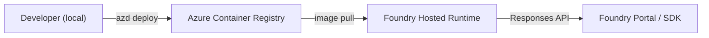

# 01 — Your First Hosted Agent

Deploy a containerized agent to the Foundry hosting platform using Microsoft Agent Framework (MAF). By the end of this lesson your agent will be running in the cloud and responding to prompts.

---

## What is a hosted agent?

A **hosted agent** is a containerized application that Foundry runs and manages for you. You write the agent logic in Python, package it in a Docker container, and deploy it with `azd`. Foundry provisions the infrastructure, handles scaling, injects credentials via managed identity, and exposes the agent through a standard **Responses API** endpoint.


```mermaid
flowchart LR
    Dev["Developer (local)"] -->|azd deploy| ACR["Azure Container Registry"]
    ACR -->|image pull| Host["Foundry Hosted Runtime"]
    Host -->|Responses API| Client["Foundry Portal / SDK"]
```

Key characteristics:

| Feature | Detail |
|---------|--------|
| Runtime | Container on Foundry-managed infrastructure |
| Auth | Managed identity injected at deploy time |
| Protocol | Responses API v2.0 |
| Port | 8088 (fixed) |
| GPU | Not required for inference (model calls go to your deployment) |

!!! tip "The hosting manifest is generated for you"
    You write the agent code (`main.py`), the container definition (`Dockerfile`),
    and its dependencies (`requirements.txt`). The **`azure.yaml`** project manifest
    that describes the hosted agent is **generated by `azd ai agent init`** and binds
    to your existing Foundry project + ACR — so it is not committed to the repo.

---

## Project structure

```
examples/01-first-hosted-agent/
├── main.py            ← agent logic
├── Dockerfile         ← container definition
├── .dockerignore      ← keeps .venv/.azure out of the build context
└── requirements.txt   ← Python dependencies
```

!!! note "`azure.yaml` is generated, not committed"
    Older previews used a separate `agent.yaml` hosting file. That is now **legacy** —
    the modern tooling defines the agent as a service block inside **`azure.yaml`**,
    which `azd ai agent init` generates for you (see [Try it](#try-it)). Because it
    embeds your project endpoint and ACR, it is git-ignored rather than committed.

---

## The code

[`examples/01-first-hosted-agent/main.py`](https://github.com/beyondelastic/foundry-advanced-workshop/blob/main/examples/01-first-hosted-agent/main.py)

```python
"""Lesson 01 — Your First Hosted Agent."""

import os

from azure.identity import DefaultAzureCredential
from dotenv import load_dotenv

from agent_framework import Agent
from agent_framework.foundry import FoundryChatClient
from agent_framework_foundry_hosting import ResponsesHostServer

load_dotenv()

credential = DefaultAzureCredential()

# The hosted runtime injects FOUNDRY_PROJECT_ENDPOINT; fall back to
# AZURE_AI_PROJECT_ENDPOINT for local .env-based runs.
project_endpoint = os.environ.get("FOUNDRY_PROJECT_ENDPOINT") or os.environ["AZURE_AI_PROJECT_ENDPOINT"]

client = FoundryChatClient(
    project_endpoint=project_endpoint,
    model=os.environ["AZURE_AI_MODEL_DEPLOYMENT_NAME"],
    credential=credential,
)

agent = Agent(
    client=client,
    instructions=(
        "You are a helpful healthcare assistant. "
        "You answer questions about general health, wellness, and medical terminology. "
        "Always remind the user that your answers are for informational purposes only "
        "and not a substitute for professional medical advice."
    ),
    default_options={"store": False},
)

server = ResponsesHostServer(agent)
server.run()
```

---

## Step-by-step walkthrough

### 1. Authenticate with `DefaultAzureCredential`

```python
from azure.identity import DefaultAzureCredential
credential = DefaultAzureCredential()
```

Locally this uses your `az login` session. When deployed, Foundry injects a **managed identity** automatically — no code change needed.

### 2. Create a `FoundryChatClient`

```python
project_endpoint = os.environ.get("FOUNDRY_PROJECT_ENDPOINT") or os.environ["AZURE_AI_PROJECT_ENDPOINT"]

client = FoundryChatClient(
    project_endpoint=project_endpoint,
    model=os.environ["AZURE_AI_MODEL_DEPLOYMENT_NAME"],
    credential=credential,
)
```

The client connects your agent to a specific Foundry project and model deployment.

!!! warning "Read `FOUNDRY_PROJECT_ENDPOINT`, not `AZURE_AI_PROJECT_ENDPOINT`"
    The **hosted runtime injects `FOUNDRY_PROJECT_ENDPOINT`** (a reserved `FOUNDRY_*`
    variable) into your container — it does **not** inject `AZURE_AI_PROJECT_ENDPOINT`.
    Locally, `azd ai agent run` provides both, but in the cloud only
    `FOUNDRY_PROJECT_ENDPOINT` is guaranteed. Reading it first (with a fallback for
    local `.env` runs) is what keeps the same code working in both places. Code that
    reads only `AZURE_AI_PROJECT_ENDPOINT` runs locally but crashes in the cloud.

### 3. Define the `Agent`

```python
agent = Agent(
    client=client,
    instructions="...",
    default_options={"store": False},
)
```

- `instructions` — the system prompt that shapes the agent's behaviour.
- `default_options={"store": False}` — disables server-side conversation storage. Useful during development.

### 4. Wrap in a `ResponsesHostServer`

```python
server = ResponsesHostServer(agent)
server.run()
```

`ResponsesHostServer` exposes the agent via the **Responses API** protocol on port 8088. This is the interface the Foundry runtime expects.

### 5. The `azure.yaml` service block (generated by `init`)

There is **no `agent.yaml`** anymore. When you run `azd ai agent init` (see
[Try it](#try-it)), it generates an `azure.yaml` that describes the agent as a
service block plus a reference to your existing project:

```yaml
services:
    first-hosted-agent:
        project: .
        host: azure.ai.agent
        language: docker
        docker:
            remoteBuild: true
        uses:
            - <your-project>          # links to the ai-project service below
        container:
            resources:
                cpu: "0.5"
                memory: 1Gi
        environmentVariables:
            - name: AZURE_AI_MODEL_DEPLOYMENT_NAME
              value: ${AZURE_AI_MODEL_DEPLOYMENT_NAME}
        kind: hosted
        name: first-hosted-agent
        protocols:
            - protocol: responses
              version: 2.0.0
        startupCommand: python main.py
    <your-project>:
        host: azure.ai.project
        endpoint: https://<account>.services.ai.azure.com/api/projects/<project>
infra:
    provider: microsoft.foundry
```

- `host: azure.ai.agent` marks the hosted agent; `host: azure.ai.project` references
  your existing Foundry project (bound via `--project-id` at init).
- `protocols.version` is **`2.0.0`** — the current Responses protocol. (The old
  `agent.yaml` used `1.0.0`; the hosting SDK now warns to upgrade.)
- `environmentVariables` only maps `AZURE_AI_MODEL_DEPLOYMENT_NAME`. The project
  endpoint arrives at runtime as the platform-injected `FOUNDRY_PROJECT_ENDPOINT`
  (which is why `main.py` reads that variable).

### 6. `Dockerfile` and `.dockerignore`

```dockerfile
FROM python:3.13-slim
WORKDIR /app
COPY . user_agent/
WORKDIR /app/user_agent
RUN if [ -f requirements.txt ]; then pip install -r requirements.txt; fi
EXPOSE 8088
CMD ["python", "main.py"]
```

The standard hosted-agent Dockerfile pattern. Foundry expects port 8088.

!!! warning "Ship a `.dockerignore`"
    `azd ai agent run` creates a local `.venv/` **inside this folder**. Because the
    Dockerfile does `COPY . user_agent/`, that multi-hundred-MB directory would be
    pulled into the build context and break the remote build with
    `archive/tar: write too long`. A `.dockerignore` excluding `.venv/`, `.azure/`,
    and `__pycache__/` keeps the build context small and correct:

    ```
    .venv/
    .azure/
    __pycache__/
    *.pyc
    .git/
    .env
    ```

---

## Try it

### Generate the project manifest with `azd ai agent init`

`azd ai agent init` connects your local code to your existing Foundry project + ACR and **generates the `azure.yaml`** manifest. Run it once per clone.

!!! info "Prerequisites"
    This assumes you've already provisioned resources using `infra/main.bicep` as described in the [Prerequisites](00-prereqs.md). The Bicep template creates the Foundry account, project, `gpt-5-mini` deployment, ACR, and role assignments (AcrPull + Foundry User for the **project** identity).

First resolve your project's ARM resource ID:

```bash
cd examples/01-first-hosted-agent

export BASE_NAME=<your-unique-name>
export RESOURCE_GROUP=rg-foundry-advanced-workshop
PROJECT_ID="$(az cognitiveservices account show \
  --name $BASE_NAME --resource-group $RESOURCE_GROUP \
  --query id -o tsv)/projects/${BASE_NAME}-project"
```

Then run init in **container** mode, bound to that project:

```bash
azd ai agent init \
  --agent-name first-hosted-agent \
  --project-id "$PROJECT_ID" \
  --deploy-mode container
```

The wizard prompts you to:

1. **How do you want to initialize your agent?** → *Use the code in the current directory*
2. **Project name** → accept the default
3. **Which protocols?** → *responses* (already selected)
4. **ACR login server** → enter your registry, e.g. `<baseName>.azurecr.io`
5. **Model configuration** → *Use an existing model deployment* → select `gpt-5-mini`

This writes `azure.yaml` and creates the azd environment under `.azure/`. Both are
git-ignored — every learner generates their own.

!!! tip "Passing `--agent-name` avoids a naming gotcha"
    The interactive *"Enter a name for your agent"* prompt pre-fills the folder name
    and **appends** what you type (e.g. `01-first-hosted-agentfirst-hosted-agent`).
    Passing `--agent-name` sets the name cleanly and skips that prompt.

!!! note "No more `agent.yaml`"
    Earlier previews shipped an `agent.yaml` and the wizard asked to *"overwrite
    agent.yaml"* and *"choose Container Image (Docker)"*. That file is now legacy —
    if `init` finds one it takes a compatibility path and **skips** the modern wizard.
    Start without it so `init` generates a clean `azure.yaml`.

### Run the agent locally

Start the agent using your local `az login` credentials — no Docker or cloud resources needed:

```bash
azd ai agent run --no-client
```

The first run creates a local `.venv/` (Python 3.13) and installs `requirements.txt`, then serves the agent on `http://localhost:8088`.

!!! warning "Stale azd environment"
    `azd ai agent run` reads its values from `.azure/<env-name>/.env`, **not** from the
    workspace `.env` file. If you previously targeted a different Foundry project, the
    cached `FOUNDRY_PROJECT_ENDPOINT` will be stale. Fix it by deleting the `.azure/`
    folder and re-running `azd ai agent init`, then restart the agent.

### Invoke the agent locally

In a **separate terminal**, from the same directory:

```bash
cd examples/01-first-hosted-agent
azd ai agent invoke --local "What are the symptoms of vitamin D deficiency?"
```

Expected output:

```
Common symptoms of vitamin D deficiency include fatigue, bone pain, muscle
weakness, and mood changes. However, many people have no symptoms at all.

Please note: this information is for educational purposes only and is not
a substitute for professional medical advice.
```

!!! tip "Quick test loop"
    After making changes to `main.py`, stop the agent (Ctrl+C), then run
    `azd ai agent run --no-client` again.

### Deploy to the cloud

```bash
# Builds the container remotely, pushes to your ACR, registers a new agent version
azd deploy
```

`azd deploy` reads the generated `azure.yaml`, builds the image (remote build via
ACR), and registers a new **immutable agent version**. The first deploy takes a few
minutes.

!!! tip "If the remote build fails with `archive/tar: write too long`"
    Your build context is too large — almost always the local `.venv/` created by
    `azd ai agent run`. Confirm the `.dockerignore` is present, then retry.

### Invoke the deployed agent

!!! success "No manual role assignment needed"
    Earlier previews required assigning the **Foundry User** role to an auto-created
    **agent identity** after the first deploy. With the current tooling that step
    is **no longer required** — the Bicep template's Foundry User grant on the
    **project** identity is sufficient and the platform manages the agent's runtime
    identity. The agent invokes models immediately after deploy.

After deployment, invoke without `--local`:

```bash
azd ai agent invoke "What are the symptoms of vitamin D deficiency?"
```

You can also check agent status and view logs:

```bash
azd ai agent show
azd ai agent monitor --tail 20
```

---

## Key takeaways

- A hosted agent is a Python application packaged in a container.
- The agent is defined as a **service block in `azure.yaml`**, generated by
  `azd ai agent init` — the old `agent.yaml` is legacy.
- Read the platform-injected **`FOUNDRY_PROJECT_ENDPOINT`** in your code so it works
  both locally and in the cloud.
- The Responses **protocol version is `2.0.0`**.
- Ship a `.dockerignore` so `azd ai agent run`'s local `.venv/` stays out of the build.
- `DefaultAzureCredential` works both locally and in the cloud.
- `azd ai agent run --no-client` starts the agent locally; `azd deploy` ships it —
  no manual agent-identity role assignment required.

---

## Official references

- [Hosted agents concept](https://learn.microsoft.com/en-us/azure/foundry/agents/concepts/hosted-agents)
- [Hosted agent quickstart (azd)](https://learn.microsoft.com/en-us/azure/foundry/agents/quickstarts/quickstart-hosted-agent?pivots=azd)
- [Microsoft Agent Framework overview](https://learn.microsoft.com/en-us/agent-framework/overview/)
- [Foundry samples — 01-basic](https://github.com/microsoft-foundry/foundry-samples/tree/main/samples/python/hosted-agents/microsoft-agent-framework/01-basic)
