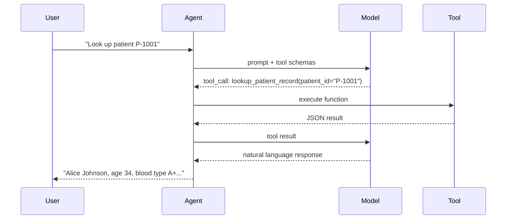

# 02 — Hosted Agent with Tools & File Persistence

Add custom tools and per-session file storage to your hosted agent. The agent can now look up patient records, calculate BMI, and save session notes that persist across turns.

---

## What you'll learn

- Define custom tools with the `@tool` decorator.
- Pass structured parameters with type annotations and Pydantic `Field` descriptions.
- Use the per-session sandbox filesystem (`/mnt/user/`) for file persistence.
- Understand session isolation — files written in one session are not visible in another.

---

## How tools work in MAF

When you register tools with an `Agent`, the framework:

1. Extracts the function signature and docstring to build a tool schema.
2. Sends the schema to the model alongside the user prompt.
3. When the model decides to call a tool, MAF executes the function locally and returns the result.



---

## Per-session file persistence

Hosted agents have access to a **per-session sandbox filesystem** mounted at `/mnt/user/`. Key properties:

| Property | Detail |
|----------|--------|
| Mount path | `/mnt/user/` |
| Scope | Per session — each conversation gets its own filesystem |
| Lifetime | Persists for the lifetime of the session |
| Isolation | Other sessions cannot read or write to this session's files |
| Use cases | Notes, generated reports, intermediate computation results |

---

## Project structure

```
examples/02-tools-and-files/
├── main.py
├── agent.yaml
├── azure.yaml
├── Dockerfile
├── requirements.txt
└── resources/
    └── sample_patient_data.txt
```

---

## The code

[`examples/02-tools-and-files/main.py`](https://github.com/beyondelastic/foundry-advanced-workshop/blob/main/examples/02-tools-and-files/main.py)

```python
"""Lesson 02 — Hosted Agent with Tools & File Persistence."""

import json
import os
from datetime import datetime
from typing import Annotated

from azure.identity import DefaultAzureCredential
from dotenv import load_dotenv
from pydantic import Field

from agent_framework import Agent, tool
from agent_framework.foundry import FoundryChatClient
from agent_framework_foundry_hosting import ResponsesHostServer

load_dotenv()

credential = DefaultAzureCredential()

client = FoundryChatClient(
    project_endpoint=os.environ["AZURE_AI_PROJECT_ENDPOINT"],
    model=os.environ["AZURE_AI_MODEL_DEPLOYMENT_NAME"],
    credential=credential,
)


@tool(approval_mode="never_require")
def lookup_patient_record(
    patient_id: Annotated[str, Field(description="The patient identifier, e.g., P-1001")],
) -> str:
    """Look up a patient record by ID. Returns basic demographics and vitals."""
    records = {
        "P-1001": {
            "name": "Alice Johnson", "age": 34, "blood_type": "A+",
            "last_visit": "2025-06-10", "conditions": ["asthma"],
        },
        "P-1002": {
            "name": "Bob Martinez", "age": 58, "blood_type": "O-",
            "last_visit": "2025-07-22", "conditions": ["type 2 diabetes", "hypertension"],
        },
        "P-1003": {
            "name": "Carol Lee", "age": 45, "blood_type": "B+",
            "last_visit": "2025-08-05", "conditions": [],
        },
    }
    record = records.get(patient_id)
    if record is None:
        return f"No patient found with ID {patient_id}."
    return json.dumps(record, indent=2)


@tool(approval_mode="never_require")
def calculate_bmi(
    weight_kg: Annotated[float, Field(description="Weight in kilograms")],
    height_m: Annotated[float, Field(description="Height in metres")],
) -> str:
    """Calculate Body Mass Index (BMI) from weight and height."""
    if height_m <= 0:
        return "Height must be greater than zero."
    bmi = weight_kg / (height_m ** 2)
    category = (
        "underweight" if bmi < 18.5
        else "normal weight" if bmi < 25
        else "overweight" if bmi < 30
        else "obese"
    )
    return f"BMI: {bmi:.1f} ({category})"


@tool(approval_mode="never_require")
def save_session_note(
    note: Annotated[str, Field(description="The note text to save")],
) -> str:
    """Save a note to the per-session sandbox filesystem."""
    notes_dir = "/mnt/user/notes"
    os.makedirs(notes_dir, exist_ok=True)
    timestamp = datetime.now().strftime("%Y%m%d_%H%M%S")
    filepath = os.path.join(notes_dir, f"note_{timestamp}.txt")
    with open(filepath, "w") as f:
        f.write(note)
    return f"Note saved to {filepath}"


@tool(approval_mode="never_require")
def list_session_notes() -> str:
    """List all notes saved in the current session."""
    notes_dir = "/mnt/user/notes"
    if not os.path.exists(notes_dir):
        return "No notes found."
    files = sorted(os.listdir(notes_dir))
    if not files:
        return "No notes found."
    results = []
    for fname in files:
        filepath = os.path.join(notes_dir, fname)
        with open(filepath, "r") as f:
            content = f.read()
        results.append(f"--- {fname} ---\n{content}")
    return "\n\n".join(results)


agent = Agent(
    client=client,
    instructions=(
        "You are a healthcare assistant with access to patient records and health tools. "
        "Use the lookup_patient_record tool when asked about a patient. "
        "Use calculate_bmi when asked about BMI. "
        "Use save_session_note and list_session_notes to manage session notes. "
        "Always remind the user your answers are informational only."
    ),
    tools=[lookup_patient_record, calculate_bmi, save_session_note, list_session_notes],
    default_options={"store": False},
)

server = ResponsesHostServer(agent)
server.run()
```

---

## Step-by-step walkthrough

### 1. Define tools with `@tool`

```python
from agent_framework import tool

@tool(approval_mode="never_require")
def lookup_patient_record(
    patient_id: Annotated[str, Field(description="The patient identifier")],
) -> str:
    """Look up a patient record by ID."""
    ...
```

- `@tool(approval_mode="never_require")` — the tool runs automatically without asking the user for permission.
- `Annotated[str, Field(description="...")]` — Pydantic annotations that become the tool's parameter description for the model.
- The **docstring** becomes the tool's description.

### 2. Patient record lookup

The `lookup_patient_record` tool simulates a database query with a dictionary of sample patient records. In production, this would call an API or query a database.

### 3. BMI calculator

`calculate_bmi` demonstrates a pure computation tool — no side effects, just math.

### 4. File persistence tools

```python
@tool(approval_mode="never_require")
def save_session_note(note: Annotated[str, Field(description="The note text to save")]) -> str:
    notes_dir = "/mnt/user/notes"
    os.makedirs(notes_dir, exist_ok=True)
    ...
```

The `/mnt/user/` path is the per-session sandbox. Files written here:

- Persist across turns within the same session.
- Are isolated from other sessions.
- Are automatically cleaned up when the session ends.

### 5. Register tools with the agent

```python
agent = Agent(
    client=client,
    instructions="...",
    tools=[lookup_patient_record, calculate_bmi, save_session_note, list_session_notes],
    ...
)
```

Pass all tools as a list. The agent's instructions should mention the tools so the model knows when to use them.

---

## Try it

### Initialize the azd environment

```bash
cd examples/02-tools-and-files
azd ai agent init
```

Follow the same wizard steps as lesson 01 (select existing code, Docker, your project, ACR, and model).

!!! warning "Fix `agent.yaml` after init"
    Ensure `agent.yaml` includes both env vars:

    ```yaml
    environment_variables:
        - name: AZURE_AI_MODEL_DEPLOYMENT_NAME
          value: ${AZURE_AI_MODEL_DEPLOYMENT_NAME}
        - name: AZURE_AI_PROJECT_ENDPOINT
          value: ${AZURE_AI_PROJECT_ENDPOINT}
    ```

### Run locally

```bash
azd ai agent run
```

### Invoke (in a separate terminal)

```bash
cd examples/02-tools-and-files
azd ai agent invoke --local "Look up patient P-1001"
```

Expected:

```
Patient P-1001 is Alice Johnson, age 34, blood type A+. Her last visit was
on 2025-06-10 and she has asthma listed as a condition.

This information is for reference purposes only.
```

```bash
azd ai agent invoke --local "Calculate BMI for weight 82kg and height 1.75m"
```

Expected:

```
BMI: 26.8 (overweight)
```

!!! note "File persistence tools won't work locally"
    The `/mnt/user/` sandbox filesystem is only available on the hosted platform. The `save_session_note` and `list_session_notes` tools will fail locally — test them after deploying to the cloud.

### Deploy to the cloud

```bash
azd deploy tools-and-files-agent
```

After the first deploy, assign the **Foundry User** role to the agent's ServiceIdentity (same pattern as lesson 01):

```bash
AGENT_NAME=tools-and-files-agent
PROJECT_NAME=${BASE_NAME}-project

AGENT_IDENTITY=$(az ad sp list \
  --display-name "${BASE_NAME}-${PROJECT_NAME}-${AGENT_NAME}-AgentIdentity" \
  --query "[0].id" -o tsv)

az role assignment create \
  --assignee-object-id "$AGENT_IDENTITY" \
  --assignee-principal-type ServicePrincipal \
  --role "53ca6127-db72-4b80-b1b0-d745d6d5456d" \
  --scope "$ACCOUNT_ID"
```

Then invoke remotely:

```bash
azd ai agent invoke "Look up patient P-1002 and calculate their BMI if weight is 95kg and height 1.80m"
```

### Test file persistence (cloud only)

```bash
azd ai agent invoke "Save a note: Patient P-1001 follow-up scheduled for December."
```

Expected (the model confirms the save — wording may vary):

```
The note about Patient P-1001 follow-up scheduled for December has been saved.
```

```bash
azd ai agent invoke "List my session notes"
```

Expected (the model summarizes the saved notes):

```
You have one session note saved: "Patient P-1001 follow-up scheduled for December."
```

!!! tip "Same session required"
    Notes persist within a session. The second invoke reuses the same session by default. Pass `--new-session` to start fresh.

---

## Key takeaways

- `@tool` turns any Python function into a tool the agent can call.
- Pydantic `Field(description=...)` helps the model understand parameters.
- `/mnt/user/` provides per-session file persistence on hosted agents.
- Each session has its own isolated sandbox filesystem.
- Tools are registered as a list in the `Agent` constructor.

---

## Official references

- [Tools in Agent Framework](https://learn.microsoft.com/en-us/agent-framework/concepts/tools/)
- [Foundry samples — 02-tools](https://github.com/microsoft-foundry/foundry-samples/tree/main/samples/python/hosted-agents/microsoft-agent-framework/02-tools)
- [Per-session file persistence](https://learn.microsoft.com/en-us/azure/foundry/agents/concepts/hosted-agents#per-session-file-persistence)
