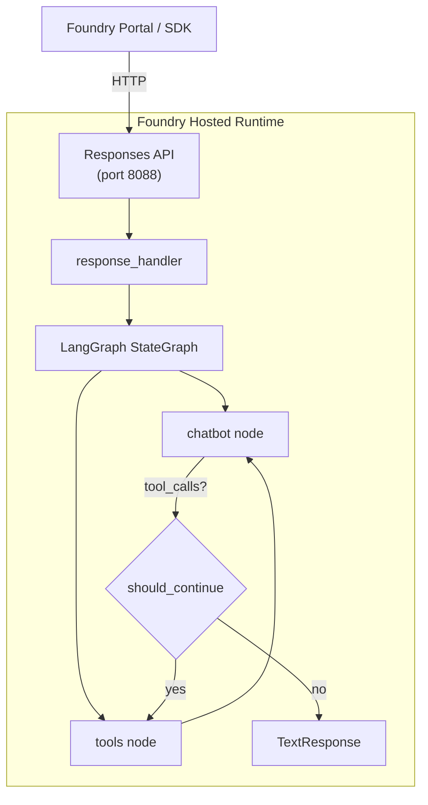

# 03 — LangGraph Hosted Agent

Build the same healthcare assistant using **LangGraph** instead of Microsoft Agent Framework. This lesson demonstrates the **BYO (Bring Your Own) framework** pattern — you can host any Python agent framework on Foundry by implementing the Responses API protocol adapter.

---

## What you'll learn

- Build a LangGraph agent with a `StateGraph`, tool nodes, and conditional routing.
- Use `ResponsesAgentServerHost` from `azure-ai-agentserver-responses` to serve the agent on Foundry.
- Understand the difference between MAF-native and BYO framework approaches.

---

## MAF vs. BYO framework

| | Microsoft Agent Framework (Lessons 01–02) | BYO framework (this lesson) |
|---|---|---|
| Protocol handling | Built-in via `ResponsesHostServer` | Manual via `ResponsesAgentServerHost` |
| Tool definition | `@tool` decorator (agent_framework) | `@tool` decorator (langchain_core) |
| Graph / orchestration | Handled internally by MAF | You build the graph (LangGraph) |
| Conversation history | Managed by MAF | You convert history from the Responses API format |
| Flexibility | Convention over configuration | Full control over the agent loop |

Both approaches produce the same result: a hosted agent accessible via the Responses API on port 8088.

---

## Architecture



---

## Project structure

```
examples/03-langgraph/
├── main.py            ← LangGraph agent + Responses API adapter
├── agent.yaml         ← hosting metadata
├── azure.yaml         ← azd project manifest
├── Dockerfile         ← identical container pattern
└── requirements.txt   ← LangGraph + protocol libraries
```

---

## The code

[`examples/03-langgraph/main.py`](https://github.com/beyondelastic/foundry-advanced-workshop/blob/main/examples/03-langgraph/main.py)

```python
"""Lesson 03 — LangGraph Hosted Agent."""

import json
import os
from typing import Annotated, Any

from azure.ai.agentserver.responses import (
    CreateResponse,
    ResponseContext,
    ResponsesAgentServerHost,
    ResponsesServerOptions,
    TextResponse,
)
from azure.identity import DefaultAzureCredential
from dotenv import load_dotenv
from langchain_azure_ai.chat_models import AzureAIOpenAIApiChatModel
from langchain_core.messages import AIMessage, HumanMessage, SystemMessage
from langchain_core.tools import tool
from langgraph.graph import END, START, StateGraph
from langgraph.graph.message import add_messages
from langgraph.prebuilt import ToolNode
from pydantic import Field
from typing_extensions import TypedDict

load_dotenv()

credential = DefaultAzureCredential()


# --- Tools ---

@tool
def lookup_patient_record(
    patient_id: Annotated[str, Field(description="Patient ID, e.g. P-1001")],
) -> str:
    """Look up a patient record by ID."""
    records = {
        "P-1001": {"name": "Alice Johnson", "age": 34, "blood_type": "A+",
                    "conditions": ["asthma"]},
        "P-1002": {"name": "Bob Martinez", "age": 58, "blood_type": "O-",
                    "conditions": ["type 2 diabetes", "hypertension"]},
    }
    record = records.get(patient_id)
    if record is None:
        return f"No patient found with ID {patient_id}."
    return json.dumps(record, indent=2)


@tool
def calculate_bmi(
    weight_kg: Annotated[float, Field(description="Weight in kilograms")],
    height_m: Annotated[float, Field(description="Height in metres")],
) -> str:
    """Calculate Body Mass Index (BMI) from weight and height."""
    if height_m <= 0:
        return "Height must be greater than zero."
    bmi = weight_kg / (height_m ** 2)
    category = (
        "underweight" if bmi < 18.5
        else "normal weight" if bmi < 25
        else "overweight" if bmi < 30
        else "obese"
    )
    return f"BMI: {bmi:.1f} ({category})"


tools = [lookup_patient_record, calculate_bmi]


# --- LLM ---

llm = AzureAIOpenAIApiChatModel(
    project_endpoint=os.environ["AZURE_AI_PROJECT_ENDPOINT"],
    model=os.environ["AZURE_AI_MODEL_DEPLOYMENT_NAME"],
    credential=credential,
).bind_tools(tools)


# --- LangGraph ---

SYSTEM_PROMPT = (
    "You are a helpful healthcare assistant. "
    "You can look up patient records and calculate BMI. "
    "Always remind the user your answers are informational only."
)


class AgentState(TypedDict):
    messages: Annotated[list, add_messages]


def chatbot(state: AgentState) -> dict[str, Any]:
    messages = [SystemMessage(content=SYSTEM_PROMPT)] + state["messages"]
    response = llm.invoke(messages)
    return {"messages": [response]}


def should_continue(state: AgentState) -> str:
    last_message = state["messages"][-1]
    if isinstance(last_message, AIMessage) and last_message.tool_calls:
        return "tools"
    return END


graph_builder = StateGraph(AgentState)
graph_builder.add_node("chatbot", chatbot)
graph_builder.add_node("tools", ToolNode(tools))

graph_builder.add_edge(START, "chatbot")
graph_builder.add_conditional_edges("chatbot", should_continue, {"tools": "tools", END: END})
graph_builder.add_edge("tools", "chatbot")

graph = graph_builder.compile()


# --- Responses API host ---

app = ResponsesAgentServerHost(
    options=ResponsesServerOptions(default_fetch_history_count=20),
)


@app.response_handler
async def handle_create(
    request: CreateResponse,
    context: ResponseContext,
    cancellation_signal: Any,
):
    messages: list = []
    history = await context.get_history()
    for item in history:
        if hasattr(item, "role") and hasattr(item, "content"):
            text = ""
            for part in item.content:
                if hasattr(part, "text"):
                    text += part.text
            if item.role == "user":
                messages.append(HumanMessage(content=text))
            elif item.role == "assistant":
                messages.append(AIMessage(content=text))

    user_text = await context.get_input_text()
    messages.append(HumanMessage(content=user_text))

    result = await graph.ainvoke({"messages": messages})

    final_message = result["messages"][-1]
    if hasattr(final_message, "content"):
        content = final_message.content
        if isinstance(content, list):
            response_text = "".join(
                part if isinstance(part, str) else part.get("text", "")
                for part in content
            )
        else:
            response_text = content
    else:
        response_text = str(final_message)
    return TextResponse(context, request, text=response_text)


if __name__ == "__main__":
    app.run()
```

---

## Step-by-step walkthrough

### 1. Define tools with LangChain's `@tool`

```python
from langchain_core.tools import tool

@tool
def lookup_patient_record(patient_id: Annotated[str, Field(...)]) -> str:
    """Look up a patient record by ID."""
    ...
```

LangChain's `@tool` decorator works similarly to MAF's — it extracts the function signature and docstring to build the tool schema. Note: no `approval_mode` parameter here.

### 2. Create the LLM and bind tools

```python
llm = AzureAIOpenAIApiChatModel(
    project_endpoint=os.environ["AZURE_AI_PROJECT_ENDPOINT"],
    model=os.environ["AZURE_AI_MODEL_DEPLOYMENT_NAME"],
    credential=credential,
).bind_tools(tools)
```

`AzureAIOpenAIApiChatModel` from `langchain-azure-ai` connects to your Foundry model deployment. `.bind_tools(tools)` tells the model about available tools.

### 3. Define the state and graph

```python
class AgentState(TypedDict):
    messages: Annotated[list, add_messages]

graph_builder = StateGraph(AgentState)
graph_builder.add_node("chatbot", chatbot)
graph_builder.add_node("tools", ToolNode(tools))
```

LangGraph uses a typed state dictionary to pass data between nodes. The graph has two nodes:

- **chatbot** — calls the LLM
- **tools** — executes tool calls from the LLM response

### 4. Add conditional routing

```python
def should_continue(state: AgentState) -> str:
    last_message = state["messages"][-1]
    if isinstance(last_message, AIMessage) and last_message.tool_calls:
        return "tools"
    return END

graph_builder.add_conditional_edges("chatbot", should_continue, {"tools": "tools", END: END})
graph_builder.add_edge("tools", "chatbot")
```

After the chatbot node runs, `should_continue` checks if the model wants to call tools. If yes, route to the tools node, then back to chatbot. If no, end the graph.

### 5. Serve via `ResponsesAgentServerHost`

```python
app = ResponsesAgentServerHost(
    options=ResponsesServerOptions(default_fetch_history_count=20),
)

@app.response_handler
async def handle_create(request, context, cancellation_signal):
    # Convert Responses API history → LangChain messages
    # Run the graph
    # Return a TextResponse
    ...
```

This is the **BYO adapter**. It:

1. Receives Responses API requests from Foundry.
2. Converts conversation history to LangChain message format.
3. Runs the LangGraph graph.
4. Returns the result as a `TextResponse`.

### 6. Same `agent.yaml` and `Dockerfile`

The hosting configuration is identical to previous lessons. Foundry doesn't care which framework you use — it only needs the Responses API on port 8088.

---

## Try it

### Initialize the azd environment

```bash
cd examples/03-langgraph
azd ai agent init
```

Follow the same wizard steps as previous lessons (select existing code, Docker, your project, ACR, and model).

!!! warning "Fix `agent.yaml` after init"
    Ensure `agent.yaml` includes both env vars:

    ```yaml
    environment_variables:
        - name: AZURE_AI_MODEL_DEPLOYMENT_NAME
          value: ${AZURE_AI_MODEL_DEPLOYMENT_NAME}
        - name: AZURE_AI_PROJECT_ENDPOINT
          value: ${AZURE_AI_PROJECT_ENDPOINT}
    ```

### Run locally

```bash
azd ai agent run
```

### Invoke (in a separate terminal)

```bash
cd examples/03-langgraph
azd ai agent invoke --local "Look up patient P-1002"
```

Expected:

```
Patient P-1002 is Bob Martinez, age 58, blood type O-. He has type 2 diabetes
and hypertension listed as conditions.

Please note this is for informational purposes only.
```

```bash
azd ai agent invoke --local "What's the BMI for someone who weighs 95kg and is 1.80m tall?"
```

Expected:

```
BMI: 29.3 (overweight)
```

### Deploy to the cloud

```bash
azd deploy langgraph-agent
```

After the first deploy, assign the **Foundry User** role to the agent's ServiceIdentity:

```bash
AGENT_NAME=langgraph-agent
PROJECT_NAME=${BASE_NAME}-project

AGENT_IDENTITY=$(az ad sp list \
  --display-name "${BASE_NAME}-${PROJECT_NAME}-${AGENT_NAME}-AgentIdentity" \
  --query "[0].id" -o tsv)

az role assignment create \
  --assignee-object-id "$AGENT_IDENTITY" \
  --assignee-principal-type ServicePrincipal \
  --role "53ca6127-db72-4b80-b1b0-d745d6d5456d" \
  --scope "$ACCOUNT_ID"
```

Then invoke remotely:

```bash
azd ai agent invoke "Look up patient P-1001 and calculate BMI for 70kg at 1.65m"
```

---

## Key takeaways

- You can host **any** Python agent framework on Foundry using the BYO pattern.
- `ResponsesAgentServerHost` is the protocol adapter that bridges your framework to Foundry.
- LangGraph gives you explicit control over the agent loop with `StateGraph`, nodes, and conditional edges.
- The `agent.yaml` and `Dockerfile` are the same regardless of framework.
- The tools produce identical results — the difference is in orchestration, not capability.

---

## Official references

- [Foundry samples — LangGraph chat](https://github.com/microsoft-foundry/foundry-samples/tree/main/samples/python/hosted-agents/langgraph/langgraph-chat)
- [BYO framework hosted agents](https://learn.microsoft.com/en-us/azure/foundry/agents/concepts/hosted-agents#bring-your-own-framework)
- [LangGraph documentation](https://langchain-ai.github.io/langgraph/)
- [langchain-azure-ai](https://python.langchain.com/docs/integrations/chat/azure_ai/)
- [azure-ai-agentserver-responses](https://pypi.org/project/azure-ai-agentserver-responses/)
