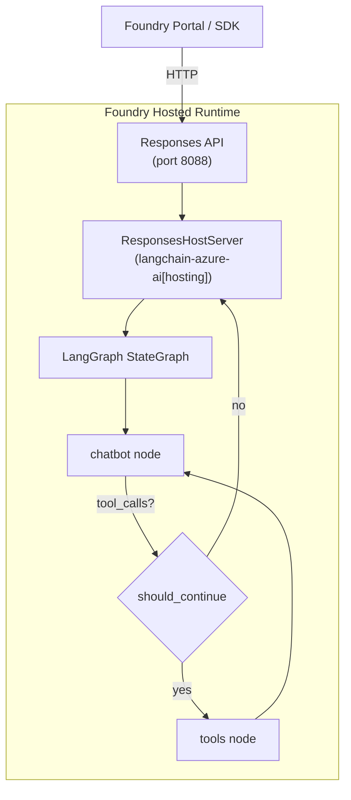

# 03 — LangGraph Hosted Agent

Build the same healthcare assistant using **LangGraph** instead of Microsoft Agent Framework. Since GA, Microsoft ships a supported hosting package — [`langchain-azure-ai[hosting]`](https://learn.microsoft.com/en-us/azure/foundry/how-to/develop/langchain-hosted-agents) — whose `ResponsesHostServer` takes a **compiled LangGraph graph** and handles all the Responses protocol plumbing for you. You build the graph; it does the rest. No hand-written adapter required.

---

## What you'll learn

- Build a LangGraph agent with a `StateGraph`, tool nodes, and conditional routing.
- Host a compiled LangGraph graph with `ResponsesHostServer` from `langchain-azure-ai[hosting]`.
- Understand the difference between the MAF-native and LangGraph-on-Foundry approaches.

---

## MAF vs. LangGraph on Foundry

| | Microsoft Agent Framework (Lessons 01–02) | LangGraph on Foundry (this lesson) |
|---|---|---|
| Protocol handling | Built-in via MAF `ResponsesHostServer` | Built-in via `langchain-azure-ai[hosting]` `ResponsesHostServer` |
| Tool definition | `@tool` decorator (agent_framework) | `@tool` decorator (langchain_core) |
| Graph / orchestration | Handled internally by MAF | You build the graph (LangGraph) |
| Conversation history | Managed by MAF | Managed by the hosting package |
| Flexibility | Convention over configuration | Full control over the agent loop |

Both approaches produce the same result: a hosted agent accessible via the Responses API on port 8088.

!!! note "No more hand-written adapter"
    Earlier previews required a custom `ResponsesAgentServerHost` handler that
    translated Responses requests into LangChain messages and back. The supported
    `langchain-azure-ai[hosting]` package now does that for you — you pass it the
    compiled graph and nothing else.

---

## Architecture


```mermaid
flowchart TB
    subgraph "Foundry Hosted Runtime"
        API["Responses API<br/>(port 8088)"] --> Host["ResponsesHostServer<br/>(langchain-azure-ai[hosting])"]
        Host --> Graph["LangGraph StateGraph"]
        Graph --> Chatbot["chatbot node"]
        Chatbot -->|tool_calls?| Route{"should_continue"}
        Route -->|yes| Tools["tools node"]
        Route -->|no| Host
        Tools --> Chatbot
    end
    Client["Foundry Portal / SDK"] -->|HTTP| API
```

---

## Project structure

```
examples/03-langgraph/
├── main.py            ← LangGraph graph + ResponsesHostServer
├── Dockerfile         ← identical container pattern
├── .dockerignore
└── requirements.txt   ← LangGraph + langchain-azure-ai[hosting]
```

!!! note "`azure.yaml` is generated by `azd ai agent init`"
    As in lessons 01–02, the hosting manifest is generated by `init` and git-ignored —
    there is no committed `agent.yaml`.

---

## The code

[`examples/03-langgraph/main.py`](https://github.com/beyondelastic/foundry-advanced-workshop/blob/main/examples/03-langgraph/main.py)

```python
"""Lesson 03 — LangGraph Hosted Agent."""

import json
import os
from typing import Annotated, Any

from azure.identity import DefaultAzureCredential
from dotenv import load_dotenv
from langchain_azure_ai.agents.hosting import ResponsesHostServer
from langchain_azure_ai.chat_models import AzureAIOpenAIApiChatModel
from langchain_core.messages import AIMessage, SystemMessage
from langchain_core.tools import tool
from langgraph.graph import END, START, StateGraph
from langgraph.graph.message import add_messages
from langgraph.prebuilt import ToolNode
from pydantic import Field
from typing_extensions import TypedDict

load_dotenv()

credential = DefaultAzureCredential()


# --- Tools ---

@tool
def lookup_patient_record(
    patient_id: Annotated[str, Field(description="Patient ID, e.g. P-1001")],
) -> str:
    """Look up a patient record by ID."""
    records = {
        "P-1001": {"name": "Alice Johnson", "age": 34, "blood_type": "A+",
                    "conditions": ["asthma"]},
        "P-1002": {"name": "Bob Martinez", "age": 58, "blood_type": "O-",
                    "conditions": ["type 2 diabetes", "hypertension"]},
    }
    record = records.get(patient_id)
    if record is None:
        return f"No patient found with ID {patient_id}."
    return json.dumps(record, indent=2)


@tool
def calculate_bmi(
    weight_kg: Annotated[float, Field(description="Weight in kilograms")],
    height_m: Annotated[float, Field(description="Height in metres")],
) -> str:
    """Calculate Body Mass Index (BMI) from weight and height."""
    if height_m <= 0:
        return "Height must be greater than zero."
    bmi = weight_kg / (height_m ** 2)
    category = (
        "underweight" if bmi < 18.5
        else "normal weight" if bmi < 25
        else "overweight" if bmi < 30
        else "obese"
    )
    return f"BMI: {bmi:.1f} ({category})"


tools = [lookup_patient_record, calculate_bmi]


# --- LLM ---

llm = AzureAIOpenAIApiChatModel(
    project_endpoint=os.environ.get("FOUNDRY_PROJECT_ENDPOINT") or os.environ["AZURE_AI_PROJECT_ENDPOINT"],
    model=os.environ["AZURE_AI_MODEL_DEPLOYMENT_NAME"],
    credential=credential,
).bind_tools(tools)


# --- LangGraph ---

SYSTEM_PROMPT = (
    "You are a helpful healthcare assistant. "
    "You can look up patient records and calculate BMI. "
    "Always remind the user your answers are informational only."
)


class AgentState(TypedDict):
    messages: Annotated[list, add_messages]


def chatbot(state: AgentState) -> dict[str, Any]:
    messages = [SystemMessage(content=SYSTEM_PROMPT)] + state["messages"]
    response = llm.invoke(messages)
    return {"messages": [response]}


def should_continue(state: AgentState) -> str:
    last_message = state["messages"][-1]
    if isinstance(last_message, AIMessage) and last_message.tool_calls:
        return "tools"
    return END


graph_builder = StateGraph(AgentState)
graph_builder.add_node("chatbot", chatbot)
graph_builder.add_node("tools", ToolNode(tools))

graph_builder.add_edge(START, "chatbot")
graph_builder.add_conditional_edges("chatbot", should_continue, {"tools": "tools", END: END})
graph_builder.add_edge("tools", "chatbot")

graph = graph_builder.compile()


# --- Responses API host ---
# ResponsesHostServer takes the compiled graph directly and handles
# Responses history, threading, and streaming.

if __name__ == "__main__":
    port = int(os.environ.get("PORT", "8088"))
    ResponsesHostServer(graph).run(port=port)
```

---

## Step-by-step walkthrough

### 1. Define tools with LangChain's `@tool`

```python
from langchain_core.tools import tool

@tool
def lookup_patient_record(patient_id: Annotated[str, Field(...)]) -> str:
    """Look up a patient record by ID."""
    ...
```

LangChain's `@tool` decorator works similarly to MAF's — it extracts the function signature and docstring to build the tool schema. Note: no `approval_mode` parameter here.

### 2. Create the LLM and bind tools

```python
llm = AzureAIOpenAIApiChatModel(
    project_endpoint=os.environ.get("FOUNDRY_PROJECT_ENDPOINT") or os.environ["AZURE_AI_PROJECT_ENDPOINT"],
    model=os.environ["AZURE_AI_MODEL_DEPLOYMENT_NAME"],
    credential=credential,
).bind_tools(tools)
```

`AzureAIOpenAIApiChatModel` from `langchain-azure-ai` connects to your Foundry model deployment. `.bind_tools(tools)` tells the model about available tools. The hosted runtime injects `FOUNDRY_PROJECT_ENDPOINT`; the fallback keeps local `.env` runs working.

### 3. Define the state and graph

```python
class AgentState(TypedDict):
    messages: Annotated[list, add_messages]

graph_builder = StateGraph(AgentState)
graph_builder.add_node("chatbot", chatbot)
graph_builder.add_node("tools", ToolNode(tools))
```

LangGraph uses a typed state dictionary to pass data between nodes. The graph has two nodes:

- **chatbot** — calls the LLM
- **tools** — executes tool calls from the LLM response

### 4. Add conditional routing

```python
def should_continue(state: AgentState) -> str:
    last_message = state["messages"][-1]
    if isinstance(last_message, AIMessage) and last_message.tool_calls:
        return "tools"
    return END

graph_builder.add_conditional_edges("chatbot", should_continue, {"tools": "tools", END: END})
graph_builder.add_edge("tools", "chatbot")
```

After the chatbot node runs, `should_continue` checks if the model wants to call tools. If yes, route to the tools node, then back to chatbot. If no, end the graph.

### 5. Serve the graph with `ResponsesHostServer`

```python
from langchain_azure_ai.agents.hosting import ResponsesHostServer

if __name__ == "__main__":
    port = int(os.environ.get("PORT", "8088"))
    ResponsesHostServer(graph).run(port=port)
```

That's the entire hosting layer. `ResponsesHostServer` from `langchain-azure-ai[hosting]` takes the **compiled graph** and:

1. Serves the Responses API on port 8088.
2. Converts incoming requests into the graph's `messages` state (and history back).
3. Runs the graph and streams the result.

No hand-written adapter, message conversion, or `TextResponse` wiring required.

### 6. Same container pattern

The `Dockerfile` and the generated `azure.yaml` are the same shape as previous lessons. Foundry only needs the Responses API on port 8088.

---

## Try it

### Generate the project manifest with `azd ai agent init`

Bind to your existing project and ACR (see [lesson 01](01-your-first-hosted-agent.md) for the full wizard walkthrough):

```bash
cd examples/03-langgraph

export BASE_NAME=<your-unique-name>
export RESOURCE_GROUP=rg-foundry-advanced-workshop
PROJECT_ID="$(az cognitiveservices account show \
  --name $BASE_NAME --resource-group $RESOURCE_GROUP \
  --query id -o tsv)/projects/${BASE_NAME}-project"

azd ai agent init \
  --agent-name langgraph-agent \
  --project-id "$PROJECT_ID" \
  --deploy-mode container \
  --model-deployment gpt-5-mini
```

### Run locally

```bash
azd ai agent run --no-client
```

### Invoke (in a separate terminal)

```bash
cd examples/03-langgraph
azd ai agent invoke --local "Look up patient P-1002"
```

Expected:

```
Patient P-1002 is Bob Martinez, age 58, blood type O-. He has type 2 diabetes
and hypertension listed as conditions.

Please note this is for informational purposes only.
```

```bash
azd ai agent invoke --local "What's the BMI for someone who weighs 95kg and is 1.80m tall?"
```

Expected:

```
BMI: 29.3 (overweight)
```

### Deploy to the cloud

```bash
azd deploy
```

No manual agent-identity role assignment is needed (see [lesson 01](01-your-first-hosted-agent.md#invoke-the-deployed-agent)). Then invoke remotely:

```bash
azd ai agent invoke "Look up patient P-1001 and calculate BMI for 70kg at 1.65m"
```

---

## Key takeaways

- Microsoft's supported `langchain-azure-ai[hosting]` package hosts a compiled LangGraph graph directly — no hand-written adapter.
- `ResponsesHostServer(graph).run()` is the entire hosting layer.
- LangGraph gives you explicit control over the agent loop with `StateGraph`, nodes, and conditional edges.
- The container pattern is the same regardless of framework — Foundry only needs the Responses API on port 8088.
- The tools produce identical results — the difference is in orchestration, not capability.

---

## Official references

- [Host LangGraph agents as Foundry hosted agents](https://learn.microsoft.com/en-us/azure/foundry/how-to/develop/langchain-hosted-agents)
- [Foundry samples — LangGraph chat](https://github.com/microsoft-foundry/foundry-samples/tree/main/samples/python/hosted-agents/langgraph/langgraph-chat)
- [LangGraph documentation](https://langchain-ai.github.io/langgraph/)
- [langchain-azure-ai](https://python.langchain.com/docs/integrations/chat/azure_ai/)
