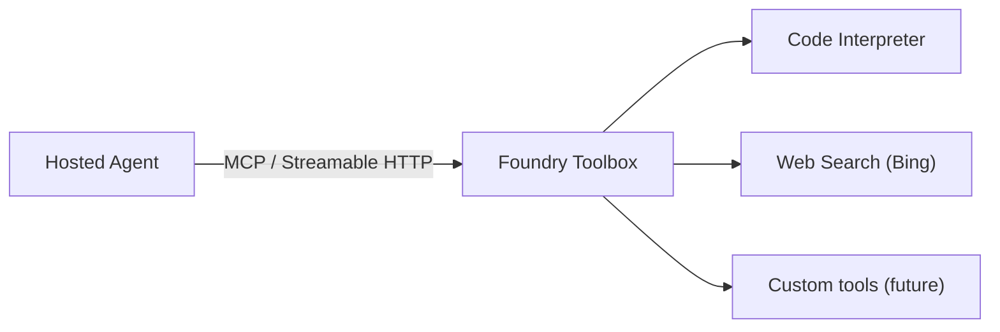

# 04 — Foundry Toolbox

Connect your hosted agent to a **Foundry Toolbox** — a managed collection of tools (Code Interpreter, Web Search, and more) exposed via an MCP (Model Context Protocol) endpoint. Your agent gains powerful capabilities without you having to build or host them.

---

## What you'll learn

- What a Foundry Toolbox is and how it works.
- Create a Toolbox with Code Interpreter and Web Search in the Foundry portal.
- Connect to the Toolbox MCP endpoint using `MCPStreamableHTTPTool`.
- Authenticate with `ToolboxAuth` (bearer token injection).
- Mix local tools and Toolbox tools in the same agent.

---

## What is a Foundry Toolbox?

A **Toolbox** is a managed resource in your Foundry project that bundles one or more server-side tools behind an MCP-compliant endpoint. You create a Toolbox in the portal, add tools (like Code Interpreter or Web Search), and your agent connects to it over HTTP.



Key properties:

| Feature | Detail |
|---------|--------|
| Protocol | MCP (Streamable HTTP transport) |
| Authentication | Azure AD bearer token (`cognitiveservices.azure.com/.default`) |
| Built-in tools | Code Interpreter, Web Search (Bing), File Search |
| Scope | Per Foundry project |
| Endpoint format | `{project_endpoint}/toolboxes/{toolbox_name}/mcp` |

---

## Create a Toolbox

Before deploying this lesson's agent, create a Toolbox in the Foundry portal:

1. Open your Foundry project in the [Foundry portal](https://ai.azure.com).
2. Navigate to **Build** → **Toolboxes**.
3. Click **+ Create toolbox**.
4. Give it a name (e.g., `workshop-toolbox`).
5. Add tools:
   - **Code Interpreter** — executes Python code in a sandboxed environment.
   - **Web Search** — searches the web using Bing (requires a Bing resource or Grounding with Bing Search connection).
6. Click **Create**.

!!! tip "Toolbox name"
    Note the toolbox name — you'll need it for the `TOOLBOX_NAME` environment variable.

### Update your `.env`

Add the toolbox name to your `.env` file:

```
TOOLBOX_NAME=workshop-toolbox
```

---

## Project structure

```
examples/04-toolbox/
├── main.py            ← agent with Toolbox MCP integration
├── agent.yaml         ← includes TOOLBOX_NAME env var
├── azure.yaml         ← azd project manifest
├── Dockerfile
└── requirements.txt
```

---

## The code

[`examples/04-toolbox/main.py`](https://github.com/beyondelastic/foundry-advanced-workshop/blob/main/examples/04-toolbox/main.py)

```python
"""Lesson 04 — Foundry Toolbox."""

import os
from typing import Annotated

import httpx
from azure.identity import DefaultAzureCredential
from dotenv import load_dotenv
from pydantic import Field

from agent_framework import Agent, MCPStreamableHTTPTool, tool
from agent_framework.foundry import FoundryChatClient
from agent_framework_foundry_hosting import ResponsesHostServer

load_dotenv()

credential = DefaultAzureCredential()

client = FoundryChatClient(
    project_endpoint=os.environ["AZURE_AI_PROJECT_ENDPOINT"],
    model=os.environ["AZURE_AI_MODEL_DEPLOYMENT_NAME"],
    credential=credential,
)


class ToolboxAuth(httpx.Auth):
    """Injects a bearer token into requests to the Toolbox MCP endpoint."""

    def __init__(self, credential: DefaultAzureCredential) -> None:
        self._credential = credential

    def auth_flow(self, request: httpx.Request):
        token = self._credential.get_token(
            "https://cognitiveservices.azure.com/.default"
        )
        request.headers["Authorization"] = f"Bearer {token.token}"
        yield request


def resolve_toolbox_endpoint() -> str:
    project_endpoint = os.environ["AZURE_AI_PROJECT_ENDPOINT"].rstrip("/")
    toolbox_name = os.environ["TOOLBOX_NAME"]
    return f"{project_endpoint}/toolboxes/{toolbox_name}/mcp"


auth = ToolboxAuth(credential)
http_client = httpx.AsyncClient(auth=auth, timeout=120)

toolbox = MCPStreamableHTTPTool(
    name="foundry_toolbox",
    url=resolve_toolbox_endpoint(),
    http_client=http_client,
    load_prompts=False,
)


@tool(approval_mode="never_require")
def summarize_findings(
    findings: Annotated[str, Field(description="The findings text to summarize")],
) -> str:
    """Summarize a set of findings into a concise bullet list."""
    return f"Summary of findings:\n{findings}"


async def main() -> None:
    agent = Agent(
        client=client,
        instructions=(
            "You are a healthcare research assistant with access to a Foundry Toolbox. "
            "Use the Code Interpreter tool to run Python code for data analysis and visualization. "
            "Use the Web Search tool to find recent medical research and guidelines. "
            "Use the summarize_findings tool to compile your results. "
            "Always cite sources and remind the user your answers are informational only."
        ),
        tools=[summarize_findings, toolbox],
        default_options={"store": False},
    )

    async with agent:
        server = ResponsesHostServer(agent)
        server.run()


if __name__ == "__main__":
    import asyncio
    asyncio.run(main())
```

---

## Step-by-step walkthrough

### 1. Toolbox authentication

```python
class ToolboxAuth(httpx.Auth):
    def __init__(self, credential):
        self._credential = credential

    def auth_flow(self, request):
        token = self._credential.get_token(
            "https://cognitiveservices.azure.com/.default"
        )
        request.headers["Authorization"] = f"Bearer {token.token}"
        yield request
```

The Toolbox MCP endpoint requires an Azure AD bearer token scoped to `cognitiveservices.azure.com/.default`. This custom `httpx.Auth` class injects the token into every request.

### 2. Build the Toolbox endpoint URL

```python
def resolve_toolbox_endpoint() -> str:
    project_endpoint = os.environ["AZURE_AI_PROJECT_ENDPOINT"].rstrip("/")
    toolbox_name = os.environ["TOOLBOX_NAME"]
    return f"{project_endpoint}/toolboxes/{toolbox_name}/mcp"
```

The Toolbox MCP endpoint follows a predictable URL pattern based on your project endpoint and toolbox name.

### 3. Create the MCP tool

```python
toolbox = MCPStreamableHTTPTool(
    name="foundry_toolbox",
    url=resolve_toolbox_endpoint(),
    http_client=http_client,
    load_prompts=False,
)
```

`MCPStreamableHTTPTool` is MAF's built-in MCP client. It connects to the Toolbox and automatically discovers all available tools (Code Interpreter, Web Search, etc.).

- `load_prompts=False` — skips loading MCP prompt templates (not needed here).
- The `http_client` carries the authentication.

### 4. Mix local and Toolbox tools

```python
agent = Agent(
    client=client,
    instructions="...",
    tools=[summarize_findings, toolbox],
    ...
)
```

You can combine local `@tool` functions and MCP tools in the same `tools` list. The agent sees all of them as callable tools.

### 5. Async context manager

```python
async with agent:
    server = ResponsesHostServer(agent)
    server.run()
```

MCP tools require async initialization (to discover available tools from the server). The `async with agent` context manager handles setup and teardown.

### 6. `agent.yaml` with `TOOLBOX_NAME`

```yaml
environment_variables:
  - name: AZURE_AI_MODEL_DEPLOYMENT_NAME
    value: ${AZURE_AI_MODEL_DEPLOYMENT_NAME}
  - name: AZURE_AI_PROJECT_ENDPOINT
    value: ${AZURE_AI_PROJECT_ENDPOINT}
  - name: TOOLBOX_NAME
    value: ${TOOLBOX_NAME}
```

The `TOOLBOX_NAME` environment variable is mapped from your Foundry project environment, just like the model deployment name.

---

## Try it

### Initialize the azd environment

```bash
cd examples/04-toolbox
azd ai agent init
```

Follow the same wizard steps as previous lessons (select existing code, Docker, your project, ACR, and model).

!!! warning "Fix `agent.yaml` after init"
    Ensure `agent.yaml` includes all three env vars:

    ```yaml
    environment_variables:
        - name: AZURE_AI_MODEL_DEPLOYMENT_NAME
          value: ${AZURE_AI_MODEL_DEPLOYMENT_NAME}
        - name: AZURE_AI_PROJECT_ENDPOINT
          value: ${AZURE_AI_PROJECT_ENDPOINT}
        - name: TOOLBOX_NAME
          value: ${TOOLBOX_NAME}
    ```

### Set the Toolbox name in your environment

Make sure the Toolbox exists in your Foundry project and the name matches:

```bash
# In your .env (for local testing)
TOOLBOX_NAME=workshop-toolbox
```

### Run locally

```bash
azd ai agent run
```

!!! note "Toolbox tools require cloud connectivity"
    Unlike lessons 01–03, the Toolbox MCP endpoint is a remote service. Even when running locally, your agent makes outbound calls to the Toolbox endpoint. Ensure you are authenticated (`az login`) and the Toolbox exists in your project.

### Invoke (in a separate terminal)

```bash
cd examples/04-toolbox
azd ai agent invoke --local "Use Code Interpreter to calculate the average BMI from this data: weights = [72, 85, 68, 95, 78], heights = [1.75, 1.82, 1.60, 1.90, 1.68]"
```

Expected: the agent writes and executes Python code, returns the computed averages.

**Web Search:**

```bash
azd ai agent invoke --local "Search for the latest WHO guidelines on hypertension management"
```

Expected: the agent searches the web and returns a summary with sources.

### Deploy to the cloud

```bash
azd deploy toolbox-agent
```

After the first deploy, assign the **Foundry User** role to the agent's managed identity:

```bash
AGENT_NAME=toolbox-agent
PROJECT_NAME=${BASE_NAME}-project

AGENT_IDENTITY=$(az ad sp list \
  --display-name "${BASE_NAME}-${PROJECT_NAME}-${AGENT_NAME}-AgentIdentity" \
  --query "[0].id" -o tsv)

az role assignment create \
  --assignee-object-id "$AGENT_IDENTITY" \
  --assignee-principal-type ServicePrincipal \
  --role "53ca6127-db72-4b80-b1b0-d745d6d5456d" \
  --scope "$ACCOUNT_ID"
```

Then invoke remotely:

```bash
azd ai agent invoke "Search for diabetes prevalence statistics, then use Code Interpreter to create a bar chart"
```

---

## Key takeaways

- A **Toolbox** bundles managed tools (Code Interpreter, Web Search) behind an MCP endpoint.
- `MCPStreamableHTTPTool` discovers and connects to Toolbox tools automatically.
- `ToolboxAuth` injects Azure AD bearer tokens for authentication.
- Local `@tool` functions and Toolbox MCP tools can be mixed in the same agent.
- The Toolbox endpoint URL follows the pattern `{project_endpoint}/toolboxes/{name}/mcp`.

---

## Official references

- [Foundry Toolbox overview](https://learn.microsoft.com/en-us/azure/foundry/agents/concepts/toolbox)
- [Foundry samples — 06-files (Toolbox example)](https://github.com/microsoft-foundry/foundry-samples/tree/main/samples/python/hosted-agents/microsoft-agent-framework/06-files)
- [MCPStreamableHTTPTool](https://learn.microsoft.com/en-us/agent-framework/concepts/tools/#mcp-tools)
- [Code Interpreter tool](https://learn.microsoft.com/en-us/azure/foundry/agents/concepts/tools/code-interpreter)
- [Web Search tool](https://learn.microsoft.com/en-us/azure/foundry/agents/concepts/tools/web-search)
