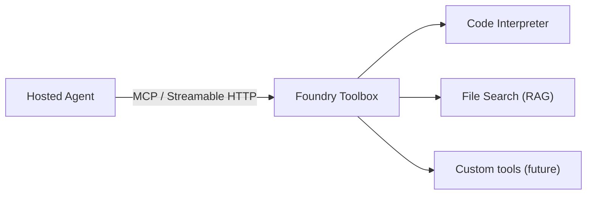

# 04 — Foundry Toolbox

Connect your hosted agent to a **Foundry Toolbox** — a managed collection of tools (Code Interpreter, File Search, and more) exposed via an MCP (Model Context Protocol) endpoint. Your agent gains powerful capabilities without you having to build or host them.

---

## What you'll learn

- What a Foundry Toolbox is and how it works.
- Create a Toolbox with Code Interpreter and File Search in the Foundry portal.
- Connect to the Toolbox MCP endpoint using `MCPStreamableHTTPTool`.
- Authenticate with `get_bearer_token_provider` and a custom `httpx.Auth` class.
- Mix local tools and Toolbox tools in the same agent.

---

## What is a Foundry Toolbox?

A **Toolbox** is a managed resource in your Foundry project that bundles one or more server-side tools behind an MCP-compliant endpoint. You create a Toolbox in the portal, add tools (like Code Interpreter or Web Search), and your agent connects to it over HTTP.


```mermaid
flowchart LR
    Agent["Hosted Agent"] -->|MCP / Streamable HTTP| Toolbox["Foundry Toolbox"]
    Toolbox --> CI["Code Interpreter"]
    Toolbox --> FS["File Search (RAG)"]
    Toolbox --> Custom["Custom tools (future)"]
```

Key properties:

| Feature | Detail |
|---------|--------|
| Protocol | MCP (Streamable HTTP transport) |
| Authentication | Azure AD bearer token (`https://ai.azure.com/.default`) |
| Required header | `Foundry-Features: Toolboxes=V1Preview` |
| Built-in tools | Code Interpreter, Web Search (Bing), File Search |
| Scope | Per Foundry project |
| Endpoint format | `{project_endpoint}/toolboxes/{toolbox_name}/mcp?api-version=v1` |

---

## Create the Toolbox

You create the Toolbox in the [Foundry portal](https://ai.azure.com) — and the vector
store for File Search is created **inline** as part of adding that tool (there is no
separate "create a vector store" step).

1. Open your Foundry project (`<baseName>-project`) → **Build** → **Toolboxes** → **+ Create toolbox**.
2. **Name** → `workshop-toolbox` (must match the `TOOLBOX_NAME` env var).
3. Under **Included**, click **+ Add** and add each tool from the **Configured** tab:
    - **File search** → in **Attach files**, choose **Index option: Create a new index**,
      name it `workshop-guidelines`, and upload `data/clinical-guidelines.md`. Wait for
      **Success**, then **Attach**.
    - **Code interpreter** → select it and **Add tool** (no configuration needed — sandboxed Python).
4. Click **Create** to publish the first version.

!!! info "Tool Search (optional)"
    The **Tool search** toggle enables the toolbox's `toolbox_search_preview` capability.
    Instead of exposing every tool's full schema via the MCP `tools/list` (which grows
    your model's context with each added tool), it exposes two meta-tools — `tool_search`
    and `call_tool` — so the agent *searches* for the right tool on demand. Microsoft
    recommends turning it on once a toolbox has **more than ~5 tools**; for this two-tool
    lesson it's optional and works either way (leaving it **off** keeps tool discovery the
    most direct).

!!! tip "Toolbox name → `TOOLBOX_NAME`"
    Add the toolbox name to your workspace `.env` for local runs:

    ```
    TOOLBOX_NAME=workshop-toolbox
    ```

---

## Project structure

```
examples/04-toolbox/
├── main.py            ← agent with Toolbox MCP integration
├── Dockerfile
├── .dockerignore
├── requirements.txt
└── data/
    └── clinical-guidelines.md  ← sample doc for File Search
```

!!! note "`azure.yaml` is generated by `azd ai agent init`"
    As in lessons 01–03, the hosting manifest is generated by `init` and git-ignored —
    there is no committed `agent.yaml`. For this lesson you add one extra env var
    (`TOOLBOX_NAME`) to the generated `azure.yaml` (see [Try it](#try-it)).

---

## The code

[`examples/04-toolbox/main.py`](https://github.com/beyondelastic/foundry-advanced-workshop/blob/main/examples/04-toolbox/main.py)

```python
"""Lesson 04 — Foundry Toolbox."""

import os
from typing import Annotated

import httpx
from azure.identity import DefaultAzureCredential, get_bearer_token_provider
from dotenv import load_dotenv
from pydantic import Field

from agent_framework import Agent, MCPStreamableHTTPTool, tool
from agent_framework.foundry import FoundryChatClient
from agent_framework_foundry_hosting import ResponsesHostServer

load_dotenv()

credential = DefaultAzureCredential()

# The hosted runtime injects FOUNDRY_PROJECT_ENDPOINT; fall back to
# AZURE_AI_PROJECT_ENDPOINT for local .env-based runs.
PROJECT_ENDPOINT = os.environ.get("FOUNDRY_PROJECT_ENDPOINT") or os.environ["AZURE_AI_PROJECT_ENDPOINT"]

client = FoundryChatClient(
    project_endpoint=PROJECT_ENDPOINT,
    model=os.environ["AZURE_AI_MODEL_DEPLOYMENT_NAME"],
    credential=credential,
)


_TOOLBOX_FEATURES = "Toolboxes=V1Preview"


class _ToolboxAuth(httpx.Auth):
    """httpx Auth that injects a fresh bearer token on every request."""

    def __init__(self, token_provider) -> None:
        self._get_token = token_provider

    def auth_flow(self, request: httpx.Request):
        request.headers["Authorization"] = f"Bearer {self._get_token()}"
        yield request


def resolve_toolbox_endpoint() -> str:
    toolbox_name = os.environ["TOOLBOX_NAME"]
    return f"{PROJECT_ENDPOINT.rstrip('/')}/toolboxes/{toolbox_name}/mcp?api-version=v1"


token_provider = get_bearer_token_provider(credential, "https://ai.azure.com/.default")
http_client = httpx.AsyncClient(
    auth=_ToolboxAuth(token_provider),
    headers={"Foundry-Features": _TOOLBOX_FEATURES},
    timeout=120.0,
)

toolbox = MCPStreamableHTTPTool(
    name="toolbox",
    url=resolve_toolbox_endpoint(),
    http_client=http_client,
    load_prompts=False,
)


@tool(approval_mode="never_require")
def summarize_findings(
    findings: Annotated[str, Field(description="The findings text to summarize")],
) -> str:
    """Summarize a set of findings into a concise bullet list."""
    return f"Summary of findings:\n{findings}"


async def main() -> None:
    agent = Agent(
        client=client,
        instructions=(
            "You are a healthcare research assistant with access to a Foundry Toolbox. "
            "Use the File Search tool to look up clinical guidelines and evidence-based recommendations. "
            "Use the Code Interpreter tool to run Python code for data analysis and calculations. "
            "Use the summarize_findings tool to compile your results. "
            "Always cite sources and remind the user your answers are informational only."
        ),
        tools=[summarize_findings, toolbox],
        default_options={"store": False},
    )

    server = ResponsesHostServer(agent)
    async with agent:
        await server.run_async()


if __name__ == "__main__":
    import asyncio
    asyncio.run(main())
```

---

## Step-by-step walkthrough

### 1. Toolbox authentication

```python
_TOOLBOX_FEATURES = "Toolboxes=V1Preview"


class _ToolboxAuth(httpx.Auth):
    def __init__(self, token_provider):
        self._get_token = token_provider

    def auth_flow(self, request):
        request.headers["Authorization"] = f"Bearer {self._get_token()}"
        yield request


token_provider = get_bearer_token_provider(credential, "https://ai.azure.com/.default")
http_client = httpx.AsyncClient(
    auth=_ToolboxAuth(token_provider),
    headers={"Foundry-Features": _TOOLBOX_FEATURES},
    timeout=120.0,
)
```

The Toolbox MCP endpoint requires:

1. An Azure AD bearer token scoped to `https://ai.azure.com/.default`.
2. The feature header `Foundry-Features: Toolboxes=V1Preview` on every request.

`get_bearer_token_provider` handles token caching and refresh automatically. The custom `httpx.Auth` class injects the token into each outbound request.

### 2. Build the Toolbox endpoint URL

```python
def resolve_toolbox_endpoint() -> str:
    toolbox_name = os.environ["TOOLBOX_NAME"]
    return f"{PROJECT_ENDPOINT.rstrip('/')}/toolboxes/{toolbox_name}/mcp?api-version=v1"
```

`PROJECT_ENDPOINT` is resolved once from `FOUNDRY_PROJECT_ENDPOINT` (with an `AZURE_AI_PROJECT_ENDPOINT` fallback). The `?api-version=v1` query parameter is **required** — omitting it returns a 400 error.

### 3. Create the MCP tool

```python
toolbox = MCPStreamableHTTPTool(
    name="toolbox",
    url=resolve_toolbox_endpoint(),
    http_client=http_client,
    load_prompts=False,
)
```

`MCPStreamableHTTPTool` is MAF's built-in MCP client. It connects to the Toolbox and automatically discovers all available tools (Code Interpreter, Web Search, etc.).

- `load_prompts=False` — **required**; the Toolbox MCP server does not implement `prompts/list`.
- The `http_client` carries both the authentication and the feature header.

### 4. Mix local and Toolbox tools

```python
agent = Agent(
    client=client,
    instructions="...",
    tools=[summarize_findings, toolbox],
    ...
)
```

You can combine local `@tool` functions and MCP tools in the same `tools` list. The agent sees all of them as callable tools.

### 5. Async context manager

```python
server = ResponsesHostServer(agent)
async with agent:
    await server.run_async()
```

MCP tools require async initialization (to discover available tools from the server). The `async with agent` context manager connects to the Toolbox, discovers tools, then starts the server. On exit it cleanly disconnects.

### 6. `azure.yaml` with `TOOLBOX_NAME`

The generated `azure.yaml` maps `AZURE_AI_MODEL_DEPLOYMENT_NAME` automatically. This lesson needs one more variable — **add `TOOLBOX_NAME`** to the agent service's `environmentVariables`:

```yaml
        environmentVariables:
            - name: AZURE_AI_MODEL_DEPLOYMENT_NAME
              value: ${AZURE_AI_MODEL_DEPLOYMENT_NAME}
            - name: TOOLBOX_NAME
              value: ${TOOLBOX_NAME}
```

The project endpoint is **not** listed here — the runtime injects `FOUNDRY_PROJECT_ENDPOINT` automatically (see lesson 01).

---

## Try it

### Generate the project manifest with `azd ai agent init`

Bind to your existing project and ACR (see [lesson 01](01-your-first-hosted-agent.md) for the full wizard walkthrough):

```bash
cd examples/04-toolbox

export BASE_NAME=<your-unique-name>
export RESOURCE_GROUP=rg-foundry-advanced-workshop
PROJECT_ID="$(az cognitiveservices account show \
  --name $BASE_NAME --resource-group $RESOURCE_GROUP \
  --query id -o tsv)/projects/${BASE_NAME}-project"

azd ai agent init \
  --agent-name toolbox-agent \
  --project-id "$PROJECT_ID" \
  --deploy-mode container \
  --model-deployment gpt-5-mini
```

### Add `TOOLBOX_NAME` (this lesson's extra step)

`init` only wires `AZURE_AI_MODEL_DEPLOYMENT_NAME`. Add `TOOLBOX_NAME` to the agent's
`environmentVariables` in the generated `azure.yaml` (see [step 6](#6-azureyaml-with-toolbox_name)),
then register it in the azd environment so it's injected at deploy time:

```bash
azd env set TOOLBOX_NAME workshop-toolbox
```

For local runs, `TOOLBOX_NAME` is also picked up from your workspace `.env`.

### Run locally

```bash
azd ai agent run --no-client
```

!!! note "Toolbox tools require cloud connectivity"
    Unlike lessons 01–03, the Toolbox MCP endpoint is a remote service. Even when running locally, your agent makes outbound calls to the Toolbox endpoint. Ensure you are authenticated (`az login`) and the Toolbox exists in your project.

### Invoke (in a separate terminal)

```bash
cd examples/04-toolbox
azd ai agent invoke --local "Use Code Interpreter to calculate the average BMI from this data: weights = [72, 85, 68, 95, 78], heights = [1.75, 1.82, 1.60, 1.90, 1.68]"
```

Expected: the agent writes and executes Python code, returns the computed averages.

**File Search:**

```bash
azd ai agent invoke --local "What are the LDL-C targets for a very high risk patient with established cardiovascular disease?"
```

Expected: the agent searches the clinical guidelines document and returns the target (< 1.4 mmol/L and ≥ 50% reduction).

**Combining both tools:**

```bash
azd ai agent invoke --local "Look up the CHA2DS2-VASc scoring criteria, then use code interpreter to calculate the score for a 70-year-old woman with hypertension and diabetes."
```

Expected: the agent retrieves the scoring table via File Search, then uses Code Interpreter to compute the score.

### Deploy to the cloud

```bash
azd deploy
```

This builds the container remotely, pushes to ACR, and registers a new agent version. No manual agent-identity role assignment is needed — the Bicep template's Foundry User grant on the **project** identity also lets the deployed agent reach the Toolbox (see [lesson 01](01-your-first-hosted-agent.md#invoke-the-deployed-agent)).

Then invoke remotely:

```bash
azd ai agent invoke "What are the first-line medications for hypertension according to the guidelines? Use Code Interpreter to create a comparison table."
```

---

## Key takeaways

- A **Toolbox** bundles managed tools (Code Interpreter, File Search, Web Search) behind an MCP endpoint.
- You create the Toolbox in the portal; File Search's vector index is created **inline** when you add that tool.
- `MCPStreamableHTTPTool` discovers and connects to Toolbox tools automatically.
- Authentication uses `get_bearer_token_provider` with scope `https://ai.azure.com/.default`.
- The `Foundry-Features: Toolboxes=V1Preview` header is **required** on all requests.
- The endpoint URL must include `?api-version=v1`, and `load_prompts=False` is mandatory.
- Add `TOOLBOX_NAME` to the agent's `environmentVariables` in `azure.yaml` and `azd env set` it.
- **Tool Search** (`toolbox_search_preview`) keeps context flat for large toolboxes — optional here.
- Local `@tool` functions and Toolbox MCP tools can be mixed in the same agent.

---

## Official references

- [Foundry Toolbox overview](https://learn.microsoft.com/en-us/azure/foundry/agents/concepts/toolbox)
- [Foundry samples — 06-files (Toolbox example)](https://github.com/microsoft-foundry/foundry-samples/tree/main/samples/python/hosted-agents/microsoft-agent-framework/06-files)
- [MCPStreamableHTTPTool](https://learn.microsoft.com/en-us/agent-framework/concepts/tools/#mcp-tools)
- [Code Interpreter tool](https://learn.microsoft.com/en-us/azure/foundry/agents/concepts/tools/code-interpreter)
- [Web Search tool](https://learn.microsoft.com/en-us/azure/foundry/agents/concepts/tools/web-search)
