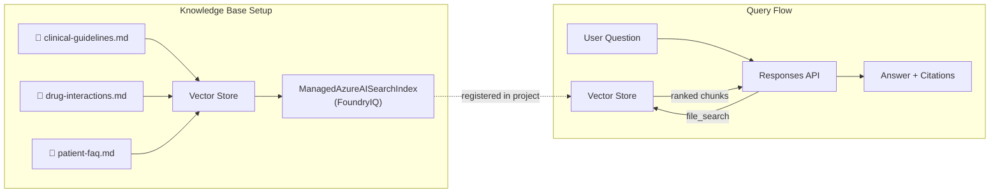

# 06 — FoundryIQ: Multi-Source Knowledge Retrieval

Build a knowledge-augmented agent that indexes multiple document sources into a managed vector store, registers it as a project-level index (FoundryIQ), and answers questions using the Responses API's `file_search` tool — with automatic cross-source synthesis and citations.

---

## What you'll learn

- How to create and manage **Vector Stores** via the OpenAI-compatible API
- How to upload and index multiple knowledge documents in different formats
- How to register a vector store as a **ManagedAzureAISearchIndex** (FoundryIQ)
- How to use the **Responses API** with `file_search` for retrieval-augmented generation
- How the model synthesises answers from **multiple sources** with citations
- The difference between FoundryIQ managed indexes and manual Azure AI Search setups

---

## Architecture

FoundryIQ abstracts away the complexity of embedding generation, chunking, and search index management — you just upload files and query:



| Component | Purpose | API |
|-----------|---------|-----|
| Vector Store | Stores embeddings + chunk metadata | `oai.vector_stores.create()` |
| File Upload | Chunks and embeds documents automatically | `oai.files.create()` + `vector_stores.files.create()` |
| ManagedAzureAISearchIndex | Registers as a project-level asset | `project_client.indexes.create_or_update()` |
| Responses API + file_search | RAG query with retrieval citations | `oai.responses.create(tools=[file_search])` |

---

## Prerequisites

- Completed [Lesson 00 — Prerequisites](00-prereqs.md)
- Your `.env` file with `AZURE_AI_PROJECT_ENDPOINT` and `AZURE_AI_MODEL_DEPLOYMENT_NAME`
- **Azure AI Search** connected to your Foundry project — FoundryIQ uses AI Search as the backing store for vector stores and managed indexes

!!! info "Azure AI Search is provisioned automatically"
    If you deployed with the workshop's Bicep template (`infra/main.bicep`), an Azure AI Search instance and its connection to your Foundry project are created automatically.

    If you're using your own Foundry project, add an AI Search connection manually:

    1. Open your project in [Microsoft Foundry](https://ai.azure.com)
    2. Go to **Build → Knowledge** (or **Operate → Admin → Manage all projects → your project**)
    3. Click **Manage connections** → **Add connection** → **Azure AI Search**
    4. Select your AI Search resource and confirm

---

## FoundryIQ vs. Manual Azure AI Search

| Aspect | FoundryIQ (this lesson) | Manual AI Search (traditional) |
|--------|------------------------|-------------------------------|
| Chunking | Automatic | You manage chunk size/overlap |
| Embeddings | Automatic (platform-managed) | You choose and call embedding model |
| Index schema | Abstracted | You define fields, dimensions, scoring |
| Search tuning | Limited — relies on platform defaults | Full control over scoring profiles, filters |
| Deployment | Zero infrastructure | Provision AI Search resource + configure |
| Best for | Rapid prototyping, moderate-scale RAG | Production systems with specific retrieval needs |

FoundryIQ is ideal when you want RAG without managing infrastructure. For production systems requiring custom scoring, hybrid search tuning, or large-scale indexes, manual AI Search gives more control.

---

## Step 1 — Review the knowledge sources

The `data/` folder contains three complementary documents:

| File | Content | Typical queries |
|------|---------|-----------------|
| `clinical-guidelines.md` | Treatment targets, medication ladders | "What's the HbA1c target?" |
| `drug-interactions.md` | Drug interaction tables with severity | "Interactions for ramipril?" |
| `patient-faq.md` | Patient-facing Q&A about medications | "Can I take ibuprofen?" |

These are intentionally designed to require cross-source retrieval — for example, a question about prescribing a guideline-recommended drug that has interactions needs data from both sources.

---

## Step 2 — Understand the code

### Knowledge base creation

```python
# Create a vector store
vector_store = oai_client.vector_stores.create(name="clinical-knowledge-base")

# Upload and attach each document
for filepath in data_files:
    file_obj = oai_client.files.create(file=open(filepath, "rb"), purpose="assistants")
    oai_client.vector_stores.files.create(
        vector_store_id=vector_store.id,
        file_id=file_obj.id,
    )
```

The platform handles chunking, embedding, and indexing automatically. No embedding model selection or chunk-size tuning needed.

### Index registration

```python
project_client.indexes.create_or_update(
    name="clinical-knowledge-base",
    version="1",
    index=ManagedAzureAISearchIndex(
        name="clinical-knowledge-base",
        version="1",
        vector_store_id=vector_store_id,
        description="Multi-source clinical knowledge base",
    ),
)
```

This registers the vector store as a discoverable project asset — other agents and team members can find and use it.

### Querying with file_search

```python
response = oai_client.responses.create(
    model="gpt-4.1-mini",
    instructions=SYSTEM_INSTRUCTIONS,
    input="What interactions does ramipril have with lithium?",
    tools=[{"type": "file_search", "vector_store_ids": [vector_store_id]}],
)
```

The Responses API automatically:

1. Generates search queries from the user's question
2. Retrieves relevant chunks from the vector store
3. Passes them as context to the model
4. Returns the answer with source annotations

---

## Step 3 — Run the demo

```bash
cd examples/06-foundry-iq
cp .env.sample .env
# Edit .env with your project endpoint

python main.py
```

The script runs 4 demo queries:

1. **Single-source (guidelines)** — HbA1c targets for diabetes
2. **Single-source (interactions)** — Amlodipine drug interactions
3. **Cross-source (guidelines + interactions)** — Ramipril for hypertension + lithium interaction
4. **Cross-source (interactions + FAQ)** — Amlodipine ankle swelling + ibuprofen safety

Watch for:

- `[Search queries: ...]` — The queries the model generates to search the knowledge base
- `[Results: N chunks retrieved]` — How many chunks came back with relevance scores
- `📎 Citations:` — Which source files were referenced

### Custom queries

You can pass a custom question as an argument (after initial setup):

```bash
python main.py "What is the first-line treatment for hypertension?"
```

---

## Step 4 — Explore the results

Key observations:

- **Multi-query generation** — For complex questions, the model generates multiple search queries to cover different aspects
- **Cross-source synthesis** — Answers combine information from guidelines, drug interactions, and patient FAQ seamlessly
- **Source attribution** — Citations tell you which documents contributed to the answer
- **Relevance scores** — Higher scores indicate better matches (useful for debugging retrieval quality)

---

## Step 5 — Clean up

```bash
python cleanup.py
```

This removes:

- The registered index from the project
- The vector store and all uploaded files

---

## Key takeaways

| Concept | Detail |
|---------|--------|
| Vector Store | Managed embedding + retrieval store — no infra to provision |
| File indexing | Upload files, platform handles chunking and embeddings |
| ManagedAzureAISearchIndex | Registers vector store as project-level asset |
| file_search tool | Responses API tool for automatic RAG with citations |
| Multi-source RAG | Model synthesises across multiple documents automatically |

---

## What's next

In the next lesson, we'll look at **observability and tracing** — how to instrument your agents for production monitoring, track token usage, measure latency, and debug retrieval quality.
