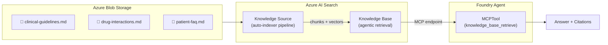

# 06 — Foundry IQ: Knowledge Base with Agentic Retrieval

Build a production-grade knowledge retrieval system using a **real Foundry IQ Knowledge Base** — a managed agentic retrieval service hosted on Azure AI Search that handles query planning, multi-source retrieval, hybrid search, semantic reranking, and LLM-powered answer synthesis.

---

## What you'll learn

- How to create a **Blob Knowledge Source** on Azure AI Search (auto-generates indexer pipeline)
- How to create a **Knowledge Base** with LLM-powered retrieval (query planning, answer synthesis)
- How to configure **retrieval instructions**, **answer instructions**, and **output modes**
- How to query the Knowledge Base via the **Retrieve API**
- How to connect the Knowledge Base to a **Foundry Agent** via **MCPTool**
- The full lifecycle: blob upload → knowledge source → knowledge base → agent integration

---

## Architecture

A Foundry IQ Knowledge Base is a first-class managed service on Azure AI Search. It orchestrates the entire retrieval pipeline — you provide documents and retrieval instructions, it handles everything else:



| Component | Purpose | API |
|-----------|---------|-----|
| Blob Storage | Stores source documents | `azure-storage-blob` |
| Knowledge Source | Auto-indexes blobs (data source → skillset → indexer → index) | `azure-search-documents` SDK |
| Knowledge Base | Orchestrates retrieval: query planning, ranking, answer synthesis | `azure-search-documents` SDK |
| Retrieve API | Queries the KB directly | REST `POST /knowledgebases/{name}/retrieve` |
| MCPTool | Connects agent to KB's MCP endpoint | `azure-ai-projects` SDK |

---

## Prerequisites

- Completed [Lesson 00 — Prerequisites](00-prereqs.md)
- Your `.env` file with the following variables:

| Variable | Example | Source |
|----------|---------|--------|
| `AZURE_AI_PROJECT_ENDPOINT` | `https://foundry-xyz.services.ai.azure.com/api/projects/...` | Bicep output |
| `AZURE_SEARCH_ENDPOINT` | `https://xyz-search.search.windows.net` | Bicep output |
| `AZURE_AI_MODEL_DEPLOYMENT_NAME` | `gpt-4.1-mini` | Your model deployment |
| `AZURE_EMBEDDING_DEPLOYMENT_NAME` | `text-embedding-3-large` | Deployed by Bicep |
| `AZURE_STORAGE_ACCOUNT_NAME` | `xyzstorage` | Bicep output |
| `AZURE_STORAGE_RESOURCE_ID` | `/subscriptions/.../storageAccounts/xyzstorage` | Bicep output |

!!! note "Derived automatically"
    The Foundry account endpoint (model/embedding resource URL) is derived from `AZURE_AI_PROJECT_ENDPOINT` in code, so there is no separate `AZURE_FOUNDRY_ENDPOINT` variable.

!!! info "Infrastructure provisioned by Bicep"
    The workshop's `infra/main.bicep` deploys:

    - **Azure AI Search** (Basic SKU, system-assigned identity, AAD + API key auth)
    - **Storage Account** with a `knowledge-docs` container
    - **text-embedding-3-large** model deployment
    - RBAC: Search → Cognitive Services User (on Foundry, for model access)
    - RBAC: Search → Storage Blob Data Reader (on Storage, for blob indexing)

---

## How Foundry IQ Knowledge Bases work

Unlike a simple vector store + file_search pattern, a Knowledge Base is a **managed agentic retrieval service**:

| Capability | Vector Store + file_search | Knowledge Base (this lesson) |
|------------|--------------------------|------------------------------|
| Chunking/embedding | Automatic (platform defaults) | Configurable (model, extraction mode) |
| Query planning | None — single search pass | LLM decomposes complex queries |
| Source routing | N/A | `retrieval_instructions` guide source selection |
| Answer synthesis | Model generates from raw chunks | KB synthesizes with citations (`answerSynthesis` mode) |
| Reasoning effort | N/A | Configurable (`minimal` / `low` / `medium`) — defaults to `low` in this lesson |
| Multi-source | Single vector store | Multiple knowledge sources per KB (blob + search index in this lesson) |
| Agent integration | `file_search` tool | MCP endpoint → Responses API `mcp` tool |

---

## Step 1 — Review the knowledge sources

The `data/` folder contains three complementary clinical documents:

| File | Content | Typical queries |
|------|---------|-----------------|
| `clinical-guidelines.md` | Treatment targets, medication ladders | "What's the HbA1c target?" |
| `drug-interactions.md` | Drug interaction tables with severity | "Interactions for ramipril?" |
| `patient-faq.md` | Patient-facing Q&A about medications | "Can I take ibuprofen?" |

These are designed to require **cross-source retrieval** — e.g., a question about prescribing a guideline-recommended drug that has known interactions.

---

## Step 2 — Understand the code

The lesson runs in 6 phases:

### Phase 1: Upload to Blob Storage

```python
blob_service = BlobServiceClient.from_connection_string(STORAGE_CONNECTION_STRING)
container = blob_service.get_container_client("knowledge-docs")
for filepath in data_files:
    blob_client.upload_blob(open(filepath, "rb"), overwrite=True)
```

### Phase 2: Create Blob Knowledge Source

```python
knowledge_source = AzureBlobKnowledgeSource(
    name="clinical-docs-ks",
    azure_blob_parameters=AzureBlobKnowledgeSourceParameters(
        connection_string=STORAGE_CONNECTION_STRING,
        container_name="knowledge-docs",
        ingestion_parameters=KnowledgeSourceIngestionParameters(
            embedding_model=KnowledgeSourceAzureOpenAIVectorizer(...),
            chat_completion_model=KnowledgeBaseAzureOpenAIModel(...),
            content_extraction_mode=KnowledgeSourceContentExtractionMode.MINIMAL,
        ),
    ),
)
index_client.create_or_update_knowledge_source(knowledge_source)
```

This auto-generates: **data source** → **skillset** → **indexer** → **search index** (chunked + vectorized).

### Phase 3: Create Knowledge Base

```python
knowledge_base = KnowledgeBase(
    name="clinical-kb",
    retrieval_instructions="...",      # How to route queries across sources
    answer_instructions="...",         # How to format answers
    output_mode="answerSynthesis",     # LLM generates cited answers
    knowledge_sources=[KnowledgeSourceReference(name="clinical-docs-ks")],
    models=[KnowledgeBaseAzureOpenAIModel(...)],
)
index_client.create_or_update_knowledge_base(knowledge_base)
```

### Phase 5: Query via Retrieve API

```python
POST {search_endpoint}/knowledgebases/clinical-kb/retrieve?api-version=2026-05-01-preview
{ "query": "What are the drug interactions for amlodipine?" }
```

Returns: `{ "answer": "...", "references": [...] }`

### Phase 6: Agent Integration via MCP

```python
mcp_kb_tool = MCPTool(
    server_label="knowledge-base",
    server_url=f"{SEARCH_ENDPOINT}/knowledgebases/clinical-kb/mcp?api-version=2026-05-01-preview",
    allowed_tools=["knowledge_base_retrieve"],
    project_connection_id=search_connection_name,
)
agent = project_client.agents.create_agent(model=..., tools=[mcp_kb_tool])
```

---

## Step 3 — Run the demo

```bash
cd examples/06-foundry-iq
python main.py
```

The script will:

1. Upload 3 markdown files to blob storage
2. Create a knowledge source (starts auto-indexing)
3. Create a knowledge base with answer synthesis
4. Wait for ingestion to complete (~2-5 minutes)
5. Run 3 demo queries showing cross-source retrieval
6. (Optional) Create an agent with MCPTool integration

Watch for:

- **Ingestion status** — progress updates as documents are chunked and vectorized
- **Answer synthesis** — full answers with reasoning, not raw chunks
- **References** — which document chunks contributed, with relevance scores

### Custom queries

```bash
python main.py --query "What is the first-line treatment for hypertension?"
```

---

## Step 4 — Clean up

```bash
python cleanup.py
```

This removes (in order):

1. The knowledge base
2. The knowledge source (and its auto-generated index, indexer, skillset, data source)
3. Uploaded blobs from the container

---

## Key takeaways

| Concept | Detail |
|---------|--------|
| Knowledge Source | Points to data (blob, SQL, files) — auto-generates indexer pipeline |
| Knowledge Base | Top-level orchestrator: query planning, source routing, answer synthesis |
| `retrieval_instructions` | Prompt that guides which sources to query for what |
| `output_mode` | `answerSynthesis` (LLM answer) vs `extractedData` (raw results) |
| MCP endpoint | Each KB exposes `{search}/knowledgebases/{name}/mcp` for agent integration |
| MCPTool | Foundry Agent tool that calls the KB's MCP endpoint |

---

## What's next

In the next lesson, we'll look at **observability and tracing** — how to instrument your agents for production monitoring, track token usage, measure latency, and debug retrieval quality.
