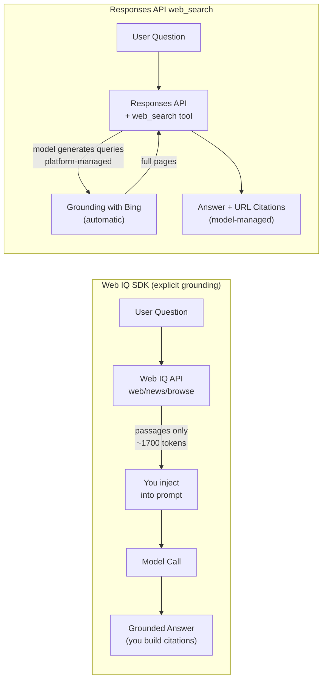

# 07 — Microsoft Web IQ: AI-Native Web Grounding

Ground your agent with the fastest, most token-efficient web intelligence available. **Microsoft Web IQ** is the grounding engine behind Copilot, OpenAI, and Nasdaq — a suite of AI-native APIs purpose-built for feeding fresh web knowledge into LLMs.

---

## What you'll learn

- How to use the **`webiq` Python SDK** for web search, news search, and page browsing
- How **passage extraction** delivers only the relevant content (fewer tokens, less noise)
- How to build a **grounded agent pipeline**: Web IQ → inject context → model reasoning
- The key differences between **Web IQ SDK vs Responses API `web_search` tool vs Bing Grounding**
- When to use each approach based on your control, cost, and latency needs

---

## Architecture

Web IQ gives YOU the results — you control exactly what enters the model's context:



---

## Web IQ vs Responses API `web_search` vs Traditional Bing

| Aspect | Web IQ SDK | Responses API `web_search` | Traditional Bing Grounding |
|--------|-----------|---------------------------|---------------------------|
| **How it works** | YOU call search, get results, inject into prompt | Model calls search automatically, manages everything | You call Bing API, parse JSON, inject into prompt |
| **Latency** | **164ms p95** (search only) | ~2-5s (search + model combined) | ~300-500ms (search only) |
| **Token efficiency** | Passage extraction = minimal tokens | Platform-managed, may include full pages | You control, but raw snippets need parsing |
| **Control** | Full: query, result count, content format, max_length | Minimal: domain filters, location, context_size | Full: query, filters, freshness |
| **Citation** | You build from URLs in results | Built-in `url_citation` annotations | You build manually |
| **Content formats** | `passage`, `text`, `html`, `markdown` | N/A (platform decides) | JSON snippets only |
| **APIs available** | Web, News, Video, Images, Browse | Web only (model may open pages) | Web, News, Video, Images (separate endpoints) |
| **Setup** | `pip install webiq` + API key | Add `{"type": "web_search"}` to tools | Provision Bing resource + API key |
| **Best for** | High-performance RAG, token-budget control, multi-source pipelines | Quick prototypes, zero-code grounding, built-in citations | Existing Bing integrations, custom ranking |

### When to use which

| Scenario | Recommendation |
|----------|---------------|
| **Production RAG with cost/latency targets** | Web IQ SDK — you control token budget and can cache results |
| **Quick prototype / internal tool** | Responses API `web_search` — one line of code, model handles everything |
| **Agentic multi-step research** | Responses API `web_search` with reasoning model — automatic search → analyse → refine |
| **News monitoring / alerting** | Web IQ SDK — dedicated news API with source attribution |
| **Reading specific URLs** | Web IQ SDK — browse API extracts clean markdown from any page |
| **Combining web + private docs** | Either — Web IQ for search + `file_search` for private RAG, or both tools together |

---

## Prerequisites

- Completed [Lesson 00 — Prerequisites](00-prereqs.md)
- **Web IQ API key** — get one from [webiq.microsoft.ai](https://webiq.microsoft.ai)
- Your `.env` file with project endpoint + model + `WEBIQ_API_KEY`

---

## Step 1 — Install the SDK

```bash
pip install webiq
```

The `webiq` package provides a typed Python client for all Web IQ APIs.

---

## Step 2 — Web search with passage extraction

The core capability — search the web and get back only the relevant passages:

```python
from webiq import WebIQClient
from webiq.types import ContentFormat

client = WebIQClient(api_key=os.environ["WEBIQ_API_KEY"])

result = client.web.search(
    "NICE guidelines hypertension management 2024",
    max_results=5,
    content_format=ContentFormat.passage,  # Key: extracts relevant passages only
    language="en",
    region="GB",
)

for r in result.webResults:
    print(f"{r.title}")
    print(f"  URL: {r.url}")
    print(f"  Content: {r.content[:200]}...")
```

**Why `ContentFormat.passage` matters:** Instead of returning full HTML pages or generic snippets, Web IQ extracts only the sentences relevant to your query. This means:

- **~1,700 tokens** for 5 results (vs potentially 10,000+ for full pages)
- **Higher signal-to-noise** — the model sees exactly what's relevant
- **Faster model inference** — less context to process

---

## Step 3 — News search for time-sensitive content

A dedicated news API with source attribution:

```python
news = client.news.search(
    "GLP-1 receptor agonist cardiovascular outcomes 2024",
    max_results=5,
    content_format=ContentFormat.passage,
)

for n in news.newsResults:
    print(f"[{n.source}] {n.title}")
    print(f"  {n.url}")
```

News search returns results ranked by recency and relevance, with explicit source attribution — critical for medical/regulatory updates.

---

## Step 4 — Browse specific URLs

Extract clean content from any web page:

```python
page = client.browse.fetch(
    "https://www.nice.org.uk/guidance/ng136",
    max_length=5000,
    content_format="markdown",
)

print(f"Title: {page.title}")
print(f"Content: {page.content[:500]}...")
```

Use browse when you already know which page has the answer — it's faster than searching and gives you structured content (markdown, HTML, or plain text).

---

## Step 5 — Build a grounded agent

The full pipeline: Web IQ search → inject results as context → model reasoning:

```python
# 1. Search with Web IQ (fast, efficient)
results = client.web.search(question, max_results=5, content_format=ContentFormat.passage)

# 2. Format as context
context = "\n\n".join(
    f"[{i}] {r.title}\n    URL: {r.url}\n    {r.content}"
    for i, r in enumerate(results.webResults, 1)
)

# 3. Send to model with grounding context
response = oai_client.responses.create(
    model="gpt-4.1-mini",
    instructions="Answer based ONLY on the provided context. Cite by [number].",
    input=f"Context:\n{context}\n\nQuestion: {question}",
)
```

This pattern gives you:

- **Separation of concerns** — search and reasoning are independent steps
- **Cacheability** — cache Web IQ results for repeated questions
- **Observability** — log exactly what context the model received
- **Token budget** — control `max_results` and `max_length` precisely

---

## Step 6 — Run the demo

```bash
cd examples/07-web-iq
cp .env.sample .env
# Edit .env with your project endpoint and Web IQ API key

python main.py
```

The script runs 5 scenarios:

1. **Web search** — NICE hypertension guidelines with passage extraction
2. **News search** — Latest GLP-1 cardiovascular research from medical journals
3. **Browse** — Deep content extraction from a specific NICE guideline page
4. **Grounded agent** — Full pipeline: search → inject → reason → answer with citations
5. **Comparison** — Web IQ SDK vs Responses API `web_search` (timing + token usage)

### Custom queries

```bash
python main.py "What new drugs were approved by the FDA this month?"
```

---

## Step 7 — The comparison that matters

The demo's final scenario runs the same question through both approaches:

| Metric | Web IQ SDK | Responses API `web_search` |
|--------|-----------|---------------------------|
| **Search latency** | ~280ms | N/A (combined) |
| **Total time** | ~8s (search + model) | ~14s (all-in-one) |
| **Context tokens** | ~1,779 (passage-extracted) | Unknown (platform-managed) |
| **Control** | Full — you decide what enters the prompt | None — model decides |
| **Code complexity** | More code (search + inject + generate) | One line (add tool) |

**The trade-off is clear:**

- **Web IQ SDK** → Faster, cheaper (fewer tokens), full control, better for production
- **Responses API `web_search`** → Simpler code, built-in citations, better for prototypes

---

## Web IQ performance characteristics

From [webiq.microsoft.ai](https://webiq.microsoft.ai):

| Metric | Web IQ | Alternatives |
|--------|--------|-------------|
| **P95 latency** | 164ms | ~400ms+ (2.5x slower) |
| **Tokens per query** | Fewest (passage extraction) | Full snippets / pages |
| **Grounding satisfaction** | Highest rated | Varies |

Web IQ is the same engine used by GitHub Copilot, OpenAI, and Nasdaq for real-time grounding.

---

## MCP integration (preview)

Web IQ also exposes an MCP server endpoint for tool-use scenarios:

```
Endpoint: https://api.microsoft.ai/v3/mcp
```

This is available in the Foundry portal tools catalog. As of this writing, it's in preview and may require additional auth configuration. The SDK approach demonstrated in this lesson is the recommended path for production use.

---

## Key takeaways

| Concept | Detail |
|---------|--------|
| **Web IQ SDK** | `pip install webiq` — typed Python client for all APIs |
| **Passage extraction** | `ContentFormat.passage` = minimal tokens, maximum relevance |
| **APIs** | `web.search()`, `news.search()`, `browse.fetch()`, `images.search()`, `videos.search()` |
| **Grounded agent** | Search → format results → inject as context → model reasons over it |
| **vs `web_search` tool** | SDK = control + speed; tool = simplicity + built-in citations |
| **Performance** | 164ms p95, fewest tokens, highest grounding satisfaction |

---

## What's next

In the next lesson, we'll explore **combining Web IQ + FoundryIQ** — using Web IQ for live web intelligence alongside `file_search` for private document RAG, creating a hybrid grounding pipeline.
